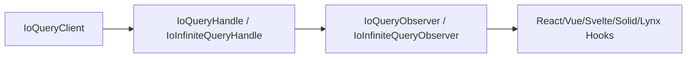
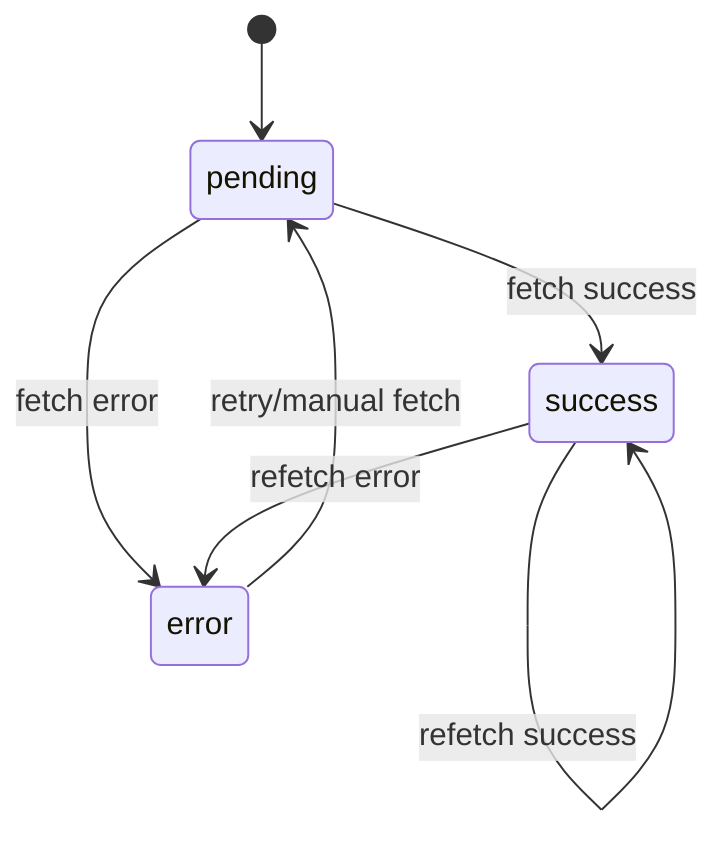

## 分层架构：Client → Handle → Observer → Hook

IO Query 推荐按 4 层来理解：

1. **Client（IoQueryClient）**：全局缓存容器，负责 query 注册、缓存读写、失效、重取、脱水/注水。
2. **Handle（IoQueryHandle / IoInfiniteQueryHandle）**：单个 query 的操作句柄，负责 fetch、cancel、invalidate、setData。
3. **Observer（IoQueryObserver / IoInfiniteQueryObserver）**：把 Handle 状态投影成可订阅结果。
4. **Hook（如 useQuery / useInfiniteQuery）**：框架层封装，管理 observer 生命周期并返回 UI 友好字段。

> 与常见 query 库相比，IO 的关键差异是 **Observer 本身就是 IoUnit**，可以被 `useIO` 直接订阅。

## Query 状态机：status × fetchStatus

Query 状态由两条轴共同构成：

- `status`: `pending` / `success` / `error`
- `fetchStatus`: `idle` / `fetching` / `paused`

派生字段常用判定：

| 字段 | 含义 | 判定心智 |
| --- | --- | --- |
| `isLoading` | 首次加载中 | `isPending && isFetching` |
| `isFetching` | 任意请求进行中 | 包括首屏与后台刷新 |
| `isRefetching` | 后台刷新中 | 已有成功数据且正在请求 |
| `isStale` | 数据已过期 | 可被 invalidation 或 staleTime 触发 |

## 读图建议

- **看首屏体验**：关注 `isLoading`。
- **看后台刷新指示**：关注 `isFetching` / `isRefetching`。
- **看缓存有效性**：关注 `isStale` 与 `invalidate()` 触发点。

## 下一步

- Infinite Query 专题：[`Infinite Query：无限加载与分页窗口`](./infinite-query/)
- API 细节：[`IoQueryClient`](/api-reference/io-query/io-query-client/)
