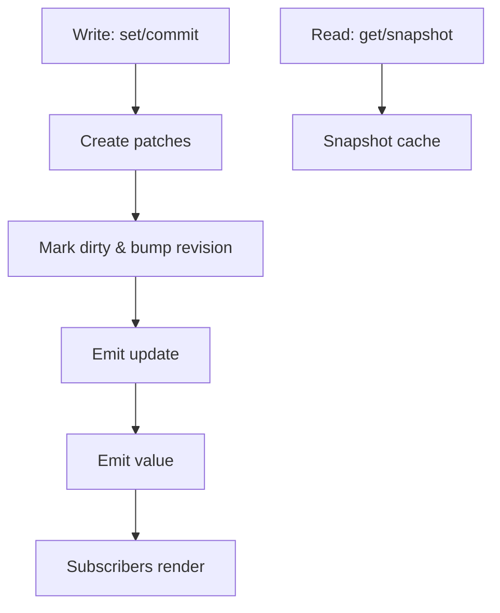

本页从运行时角度解释 IO 的代码结构与数据流，帮助你理解“为何是这样设计”，以及该从哪里扩展。

## 运行时结构

IO 的运行时由四个核心层组成：

- **状态层**：`Unit`（叶子值）与 `Tree`（Scope/Array）构成可读写的状态网格。
- **派生层**：`derived()` 用信号系统追踪读取，提供只读计算值。
- **日志层**：每次写入生成 `patch`，聚合成 `update`，支持回放与撤销。
- **扩展层**：`withBehaviors()` 将持久化、调度、DevTools 等能力注入视图。

## 关键模块

- **`core/`**：`io()`、`ioTree()` 与 `derived()` 入口。负责把 plain object/array 转成树结构。
- **`units/`**：`Unit` 的实现，维护 revision、值缓存与订阅。
- **`extensions/`**：行为扩展与 `IoView` 适配（`persist/schedule/devtools`）。
- **`utils/`**：批处理、更新日志、快照冻结、调度与类型定义。
- **`container/`**：树节点缓存与 path 索引工具。

> 代码位置：`packages/io/src/lib/`。

## 读取路径（Read）

- `get()` 会记录依赖（用于 `derived` 的依赖追踪）。
- `snapshot()` 返回冻结快照，适合序列化、日志与跨层传递。
- 树节点会做快照缓存，只在相关路径脏时重建局部快照。

## 写入路径（Write）

- `set/commit` 会生成 `patch`，递增 revision。
- 写入过程会标记脏节点，并触发 `subscribeUpdate` 与 `subscribe`。
- 批处理 `batch()` 会合并多次更新，减少重复通知。

## 订阅模型

- `subscribe(fn)` 关注“新值”（常用于 UI）。
- `subscribeUpdate(fn)` 关注“发生了什么变化”（patch/revision）。
- 在树根订阅 `subscribeUpdate` 可捕获整个 store 的变更流。

## 扩展机制

- `withBehaviors(view, [persist(), schedule(), devtools()])` 返回增强视图。
- 行为通过 `IoView` 统一接口扩展 `get/set/subscribe`。
- `extensions` 挂载扩展实例，`destroy()` 统一清理资源。

## 适配层

- **React/Vue/Svelte 适配**统一依赖 `snapshot() + subscribe()`。
- 适配器通过调度策略合并通知，降低重渲染抖动。

## 下一步

- 深入了解 [更新日志](/core-concepts/update-log/)。
- 查看 [派生值](/guides/derived/) 的依赖追踪方式。
- 学习 [行为扩展](/behaviors/overview/)。
