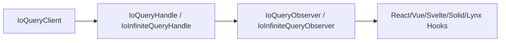
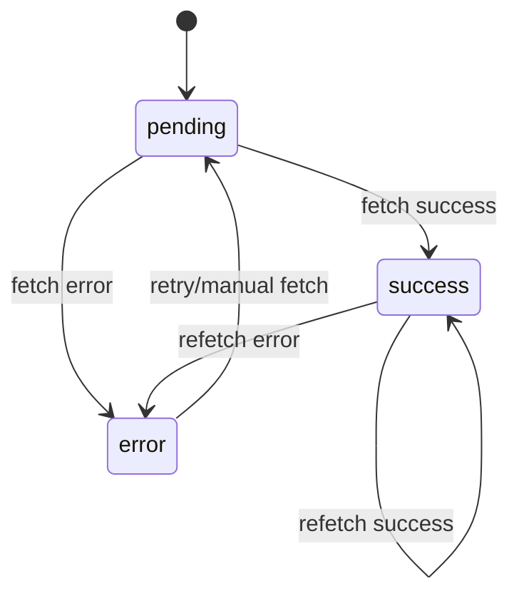

## Layered Architecture: Client → Handle → Observer → Hook

Model IO Query in four layers:

1. **Client (IoQueryClient)**: global cache container for registration, cache IO, invalidation, refetch, hydration.
2. **Handle (IoQueryHandle / IoInfiniteQueryHandle)**: per-query operation surface (`fetch`, `cancel`, `invalidate`, `setData`).
3. **Observer (IoQueryObserver / IoInfiniteQueryObserver)**: subscribable state projection for UI.
4. **Hook (for example `useQuery` / `useInfiniteQuery`)**: framework adapter managing observer lifecycle.

> A key IO difference is that the observer itself is an IoUnit, so it can be consumed directly by `useIO`.

## Query State Machine: status × fetchStatus

State is composed from two axes:

- `status`: `pending` / `success` / `error`
- `fetchStatus`: `idle` / `fetching` / `paused`

Common derived flags:

| Flag | Meaning | Mental model |
| --- | --- | --- |
| `isLoading` | First load in progress | `isPending && isFetching` |
| `isFetching` | Any request in flight | Includes first load and background refresh |
| `isRefetching` | Background refresh | Success data exists and fetching continues |
| `isStale` | Data is stale | Triggered by invalidation or staleTime |

## Reading Guide

- **First paint UX**: focus on `isLoading`.
- **Background refresh indicator**: focus on `isFetching` / `isRefetching`.
- **Cache validity**: follow `isStale` and `invalidate()`.

## Next Steps

- Infinite Query chapter: [`Infinite Query: endless loading and page windows`](./infinite-query/)
- API details: [`IoQueryClient`](/en/api-reference/io-query/io-query-client/)
