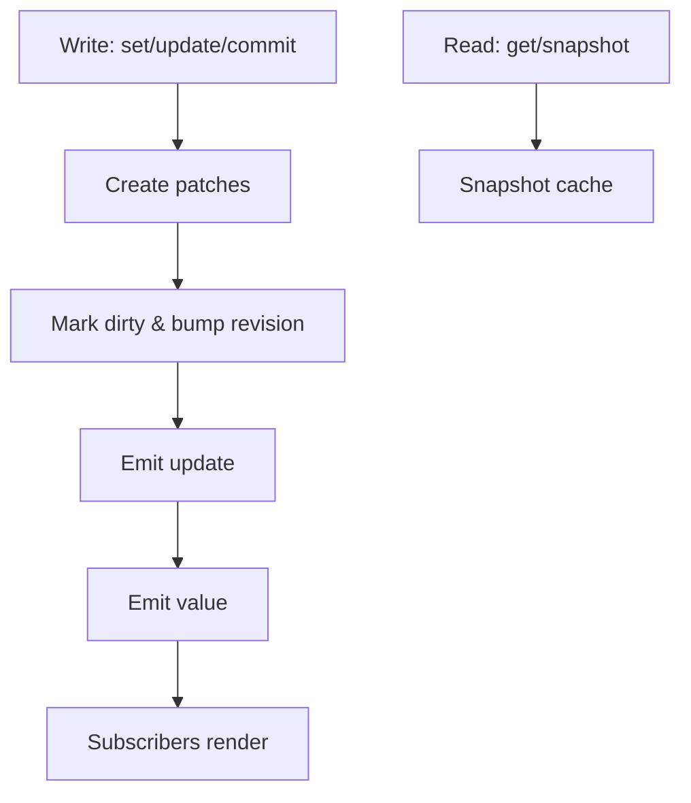

This page explains IO from a runtime perspective so you know where changes land and how the system is wired.

## Runtime Layers

IO is built from four layers:

- **State layer**: `Unit` (leaf values) and `Tree` (Scope/Array) form the writable grid.
- **Derived layer**: `derived()` tracks reads via signals and exposes read-only computations.
- **Log layer**: every write yields `patch` records, grouped into `update` objects for replay/undo.
- **Extension layer**: `withBehaviors()` injects persistence, scheduling, DevTools, and more.

## Key Modules

- **`core/`**: `io()`, `ioTree()`, and `derived()` entry points.
- **`units/`**: Unit implementation with revision, caching, and subscriptions.
- **`extensions/`**: behavior system and `IoView` adapters (`persist/schedule/devtools`).
- **`utils/`**: batching, update log, snapshots, scheduling, and types.
- **`container/`**: tree caching and path indexing.

Code lives under `packages/io/src/lib/`.

## Read Path

- `get()` records dependencies for derived tracking.
- `snapshot()` returns frozen data for serialization and safe sharing.
- Tree nodes cache snapshots and rebuild only for dirty paths.

## Write Path

- `set/update/commit` produces patches and increments revision.
- Dirty nodes are marked and both update and value subscribers are notified.
- `batch()` merges multiple updates and reduces redundant notifications.

## Subscription Model

- `subscribe(fn)` is for “new values” (UI rendering).
- `subscribeUpdate(fn)` is for “what changed” (patches and revision).
- Subscribe on the root to capture a full update stream.

## Extension Mechanism

- `withBehaviors(view, [persist(), schedule(), devtools()])` returns an enhanced view.
- Behaviors extend the `IoView` interface (`get/set/subscribe`).
- `extensions` stores instances and `destroy()` cleans them up.

## Adapters

- React/Vue/Svelte adapters rely on `snapshot() + subscribe()`.
- Schedulers coalesce updates to reduce render thrash.

## Next Steps

- Explore the [Update Log](/en/core-concepts/update-log/).
- Learn how [Derived Values](/en/guides/derived/) track reads.
- See [Behaviors](/en/behaviors/overview/) in action.
