This page is generated by `nx run apps-docs:generate-bench`.

## Run Commands

- Performance bench: `npx nx run @iostore/store:bench -- src/lib/__bench__/core-perf.bench.ts`
- GC/heap delta report: `npx nx run @iostore/store:bench-gc`

## Latest GC/Heap Delta (bench-gc)

| Scenario | Samples | Iterations | Median heap delta (bytes) | Mean heap delta (bytes) | P75 heap delta (bytes) | Median bytes/iter | Stable bytes/iter |
| --- | --- | --- | --- | --- | --- | --- | --- |
| scope: clean snapshot hit (10k) | 5 | 10000 | 240 | 2213 | 3256 | 0.02 | 0.02 |
| scope: sparse dirty set-only (2k) | 5 | 2000 | 68024 | 53122 | 69600 | 34.01 | 34.01 |
| scope: sparse dirty set-only cached-handle (2k) | 5 | 2000 | 15576 | 18890 | 22944 | 7.79 | 7.79 |
| scope: sparse dirty + snapshot (2k) | 5 | 2000 | 28504 | 40758 | 47864 | 14.25 | 14.25 |
| scope: dense dirty + snapshot (20 rounds) | 5 | 20 | 0 | 3 | 0 | 0 | 0.15 |
| array: clean snapshot hit (10k) | 5 | 10000 | 8000 | 8752 | 14264 | 0.8 | 0.8 |
| array: sparse dirty set-only (2k) | 5 | 2000 | 285152 | 280835 | 291200 | 142.58 | 142.58 |
| array: sparse dirty set-only cached-handle (2k) | 5 | 2000 | 316416 | 310566 | 317608 | 158.21 | 158.21 |
| array: sparse dirty + snapshot (2k) | 5 | 2000 | 0 | 64638 | 0 | 0 | 32.32 |
| array: dense dirty + snapshot (20 rounds) | 5 | 20 | 0 | 0 | 0 | 0 | 0 |

### Approximation (directional only)

| Scenario | Median bytes/iter | Source metric | Method |
| --- | --- | --- | --- |
| scope: sparse dirty snapshot-only (estimated) | 0 | stableBytesPerIteration | combined - set-only |
| array: sparse dirty snapshot-only (estimated) | 0 | stableBytesPerIteration | combined - set-only |

Numbers vary by hardware, load, and Node version.

## Quick Summary

### Slowest Scenarios (by mean)

| Scenario | Latest mean (ms/op) | Latest ops/sec | Latest RME (%) |
| --- | --- | --- | --- |
| commit deep update (80 boundary) | 1000.84 | 1.00 | 1.63 |
| snapshot: scope sparse dirty key (1k) | 40.89 | 24.46 | 0.99 |
| snapshot: array (20k boundary) | 38.67 | 25.86 | 1.67 |
| commit deep update (200) | 28.55 | 35.03 | 0.88 |
| batch update 200 units | 25.95 | 38.54 | 0.78 |

### Most Volatile Scenarios (by RME)

| Scenario | Latest RME (%) | Latest mean (ms/op) | Latest ops/sec |
| --- | --- | --- | --- |
| snapshot: array (20k boundary) | 1.67 | 38.67 | 25.86 |
| commit deep update (80 boundary) | 1.63 | 1000.84 | 1.00 |
| createUnit: object (1k) | 1.56 | 2.00 | 498.94 |
| snapshot: scope (10k) | 1.41 | 0.64 | 1567.32 |
| snapshot: scope dense dirty keys (1k) | 1.05 | 9.68 | 103.34 |

### Largest Regressions vs Previous

| Scenario | Delta vs previous (mean) | Latest mean (ms/op) | Latest RME (%) |
| --- | --- | --- | --- |
| subscribe/unsubscribe: update (10k) | +1.58% | 0.25 | 0.21 |
| commit deep update (200) | +1.39% | 28.55 | 0.88 |
| subscribe/unsubscribe: value (10k) | +0.64% | 0.25 | 0.19 |
| no batch: 40k updates | +0.57% | 3.95 | 0.22 |
| draft/finish: deep object (200) | +0.42% | 4.19 | 0.28 |

### Largest Improvements vs Previous

| Scenario | Delta vs previous (mean) | Latest mean (ms/op) | Latest RME (%) |
| --- | --- | --- | --- |
| snapshot: scope (10k) | -6.93% | 0.64 | 1.41 |
| commit deep update (80 boundary) | -2.29% | 1000.84 | 1.63 |
| createUnit: primitive (1k) | -2.15% | 0.80 | 0.19 |
| snapshot: scope sparse dirty key (1k) | -2.04% | 40.89 | 0.99 |
| batch update 200 units | -1.42% | 25.95 | 0.78 |

## Latest Run Environment

- Date: 2026-02-15T14:12:05.620Z
- Node: v22.22.0
- Platform: darwin 25.2.0 (arm64)
- CPU: Apple M4
- Benchmark time: 2000ms per task
- Warmup time: 250ms per task

## Run Timeline

| Run | Date | Node | Platform |
| --- | --- | --- | --- |
| 1 | 2026-02-15T10:57:02.332Z | v22.22.0 | darwin 25.2.0 (arm64) |
| 2 | 2026-02-15T10:58:08.576Z | v22.22.0 | darwin 25.2.0 (arm64) |
| 3 | 2026-02-15T11:00:45.076Z | v22.22.0 | darwin 25.2.0 (arm64) |
| 4 | 2026-02-15T11:03:51.332Z | v22.22.0 | darwin 25.2.0 (arm64) |
| 5 | 2026-02-15T11:13:27.667Z | v22.22.0 | darwin 25.2.0 (arm64) |
| 6 | 2026-02-15T11:15:33.855Z | v22.22.0 | darwin 25.2.0 (arm64) |
| 7 | 2026-02-15T11:22:12.037Z | v22.22.0 | darwin 25.2.0 (arm64) |
| 8 | 2026-02-15T13:57:47.040Z | v22.22.0 | darwin 25.2.0 (arm64) |
| 9 | 2026-02-15T14:00:53.851Z | v22.22.0 | darwin 25.2.0 (arm64) |
| 10 | 2026-02-15T14:02:58.444Z | v22.22.0 | darwin 25.2.0 (arm64) |
| 11 | 2026-02-15T14:07:57.058Z | v22.22.0 | darwin 25.2.0 (arm64) |
| 12 | 2026-02-15T14:10:14.565Z | v22.22.0 | darwin 25.2.0 (arm64) |
| 13 | 2026-02-15T14:12:05.620Z | v22.22.0 | darwin 25.2.0 (arm64) |

## Latest Results

## Latest Results by Group

### Snapshot Path

| Scenario | Latest mean (ms/op) | Latest ops/sec | Latest RME (%) | Delta vs previous (mean) |
| --- | --- | --- | --- | --- |
| snapshot: array (10k) | 0.87 | 1146.64 | 0.30 | -0.96% |
| snapshot: array (20k boundary) | 38.67 | 25.86 | 1.67 | +0.15% |
| snapshot: depth (80 boundary) | 0.29 | 3480.35 | 0.73 | +0.42% |
| snapshot: scope (10k) | 0.64 | 1567.32 | 1.41 | -6.93% |
| snapshot: scope dense dirty keys (1k) | 9.68 | 103.34 | 1.05 | -0.36% |
| snapshot: scope sparse dirty key (1k) | 40.89 | 24.46 | 0.99 | -2.04% |

### Commit Path

| Scenario | Latest mean (ms/op) | Latest ops/sec | Latest RME (%) | Delta vs previous (mean) |
| --- | --- | --- | --- | --- |
| commit deep update (200) | 28.55 | 35.03 | 0.88 | +1.39% |
| commit deep update (80 boundary) | 1000.84 | 1.00 | 1.63 | -2.29% |

### Draft/COW Path

| Scenario | Latest mean (ms/op) | Latest ops/sec | Latest RME (%) | Delta vs previous (mean) |
| --- | --- | --- | --- | --- |
| draft/finish: deep object (200) | 4.19 | 238.45 | 0.28 | +0.42% |

### Batch/Concurrency Path

| Scenario | Latest mean (ms/op) | Latest ops/sec | Latest RME (%) | Delta vs previous (mean) |
| --- | --- | --- | --- | --- |
| batch update 200 units | 25.95 | 38.54 | 0.78 | -1.42% |
| batch: 40k updates | 3.94 | 253.89 | 0.21 | -0.49% |
| no batch: 40k updates | 3.95 | 253.43 | 0.22 | +0.57% |
| sequential update 200 units | 19.45 | 51.41 | 0.50 | -1.08% |

### General Path

| Scenario | Latest mean (ms/op) | Latest ops/sec | Latest RME (%) | Delta vs previous (mean) |
| --- | --- | --- | --- | --- |
| createUnit: object (1k) | 2.00 | 498.94 | 1.56 | -0.80% |
| createUnit: primitive (1k) | 0.80 | 1243.08 | 0.19 | -2.15% |
| subscribe/unsubscribe: update (10k) | 0.25 | 3975.15 | 0.21 | +1.58% |
| subscribe/unsubscribe: value (10k) | 0.25 | 4059.62 | 0.19 | +0.64% |

## Largest Changes vs Previous Run

| Scenario | Delta vs previous (mean) | Absolute delta |
| --- | --- | --- |
| snapshot: scope (10k) | -6.93% | +6.93% |
| commit deep update (80 boundary) | -2.29% | +2.29% |
| createUnit: primitive (1k) | -2.15% | +2.15% |
| snapshot: scope sparse dirty key (1k) | -2.04% | +2.04% |
| subscribe/unsubscribe: update (10k) | +1.58% | +1.58% |
| batch update 200 units | -1.42% | +1.42% |

## Trend Charts (Change Per Bench Run)

Trend Charts by Group

### Focused Trends

### Snapshot Path

### snapshot: array (20k boundary)

- Latest: 38.67 ms/op (lower is better)
- Previous: 38.61
- Delta vs previous (mean): +0.15%

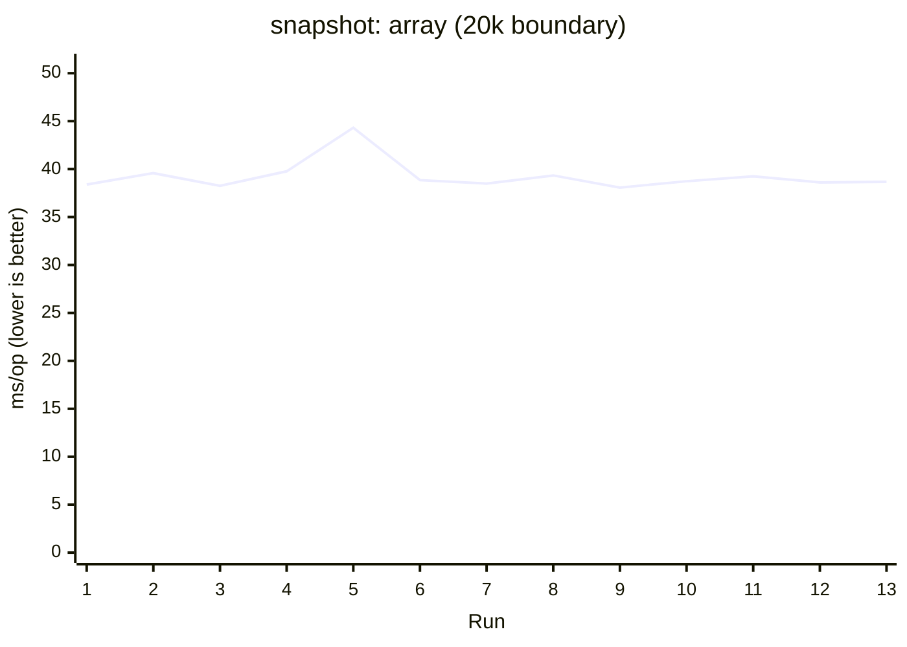
```mermaid
xychart-beta
  title "snapshot: array (20k boundary)"
  x-axis "Run" [1, 2, 3, 4, 5, 6, 7, 8, 9, 10, 11, 12, 13]
  y-axis "ms/op (lower is better)" 0 --> 50.9648
  line [38.3919, 39.5763, 38.256, 39.7677, 44.3172, 38.8518, 38.4879, 39.3373, 38.0714, 38.7314, 39.2405, 38.6115, 38.6693]
```

### snapshot: depth (80 boundary)

- Latest: 0.29 ms/op (lower is better)
- Previous: 0.29
- Delta vs previous (mean): +0.42%

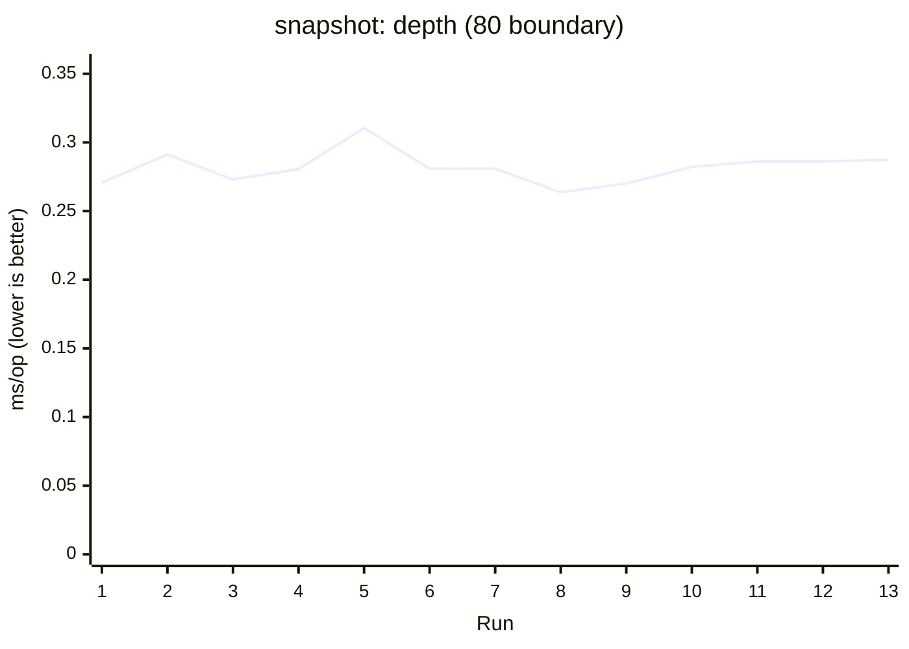
```mermaid
xychart-beta
  title "snapshot: depth (80 boundary)"
  x-axis "Run" [1, 2, 3, 4, 5, 6, 7, 8, 9, 10, 11, 12, 13]
  y-axis "ms/op (lower is better)" 0 --> 0.357
  line [0.2707, 0.2912, 0.273, 0.2806, 0.3104, 0.2808, 0.2809, 0.2637, 0.27, 0.2822, 0.2861, 0.2861, 0.2873]
```

### snapshot: scope (10k)

- Latest: 0.64 ms/op (lower is better)
- Previous: 0.69
- Delta vs previous (mean): -6.93%

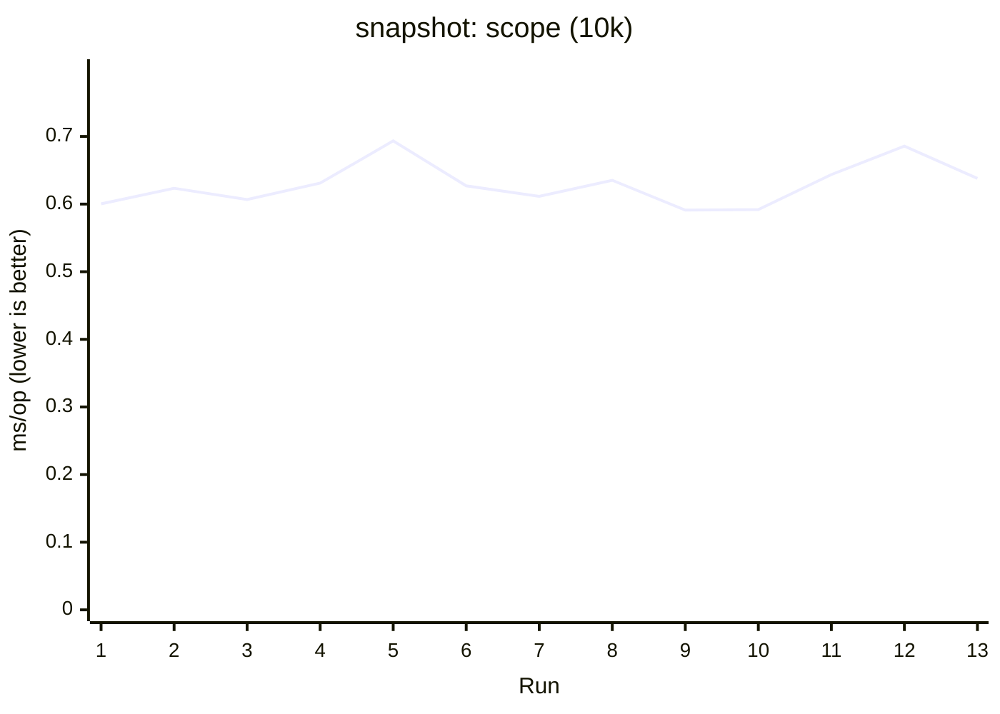
```mermaid
xychart-beta
  title "snapshot: scope (10k)"
  x-axis "Run" [1, 2, 3, 4, 5, 6, 7, 8, 9, 10, 11, 12, 13]
  y-axis "ms/op (lower is better)" 0 --> 0.7974
  line [0.6004, 0.6234, 0.6068, 0.631, 0.6934, 0.627, 0.6114, 0.6352, 0.591, 0.5919, 0.6436, 0.6856, 0.638]
```

### snapshot: scope dense dirty keys (1k)

- Latest: 9.68 ms/op (lower is better)
- Previous: 9.71
- Delta vs previous (mean): -0.36%

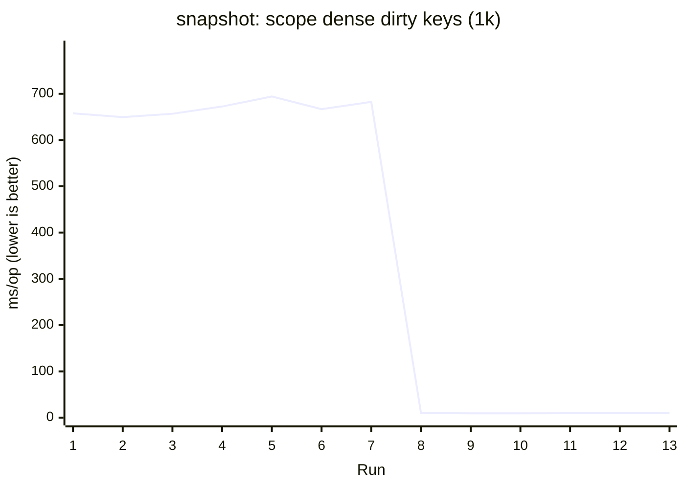
```mermaid
xychart-beta
  title "snapshot: scope dense dirty keys (1k)"
  x-axis "Run" [1, 2, 3, 4, 5, 6, 7, 8, 9, 10, 11, 12, 13]
  y-axis "ms/op (lower is better)" 0 --> 798.196
  line [657.7338, 649.4971, 656.8009, 672.4747, 694.0835, 666.831, 682.4672, 10.0629, 9.4418, 9.3377, 9.5797, 9.7117, 9.6769]
```

### snapshot: scope sparse dirty key (1k)

- Latest: 40.89 ms/op (lower is better)
- Previous: 41.74
- Delta vs previous (mean): -2.04%

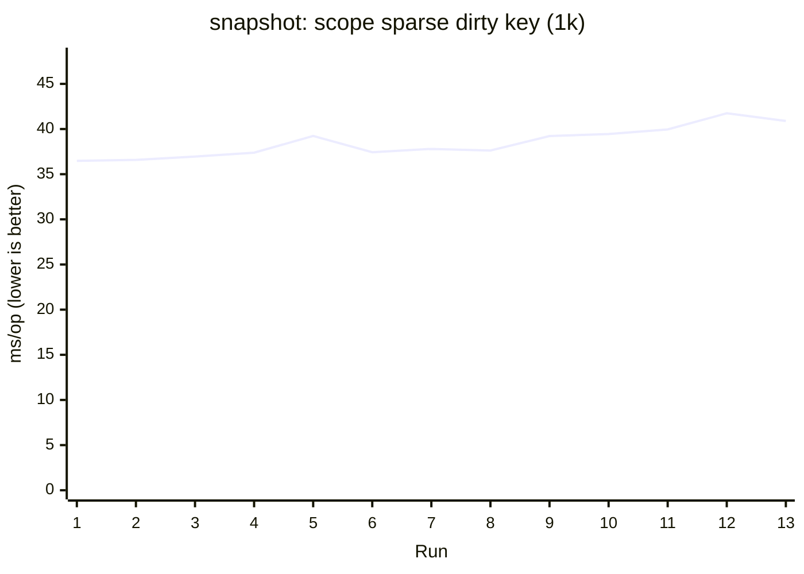
```mermaid
xychart-beta
  title "snapshot: scope sparse dirty key (1k)"
  x-axis "Run" [1, 2, 3, 4, 5, 6, 7, 8, 9, 10, 11, 12, 13]
  y-axis "ms/op (lower is better)" 0 --> 48.0046
  line [36.472, 36.5878, 36.9486, 37.3812, 39.2313, 37.435, 37.7992, 37.6167, 39.2233, 39.4452, 39.9555, 41.7431, 40.8896]
```

### Commit Path

### commit deep update (200)

- Latest: 28.55 ms/op (lower is better)
- Previous: 28.16
- Delta vs previous (mean): +1.39%

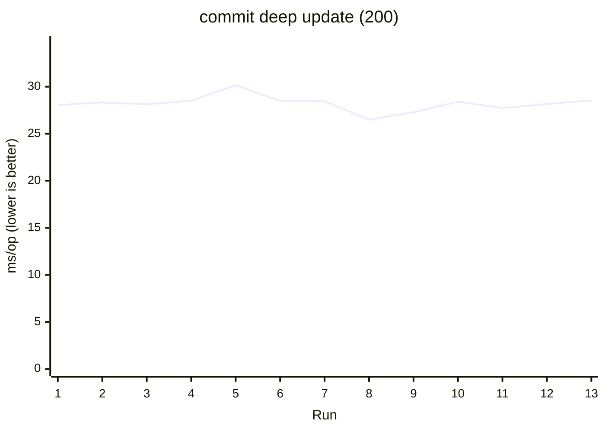
```mermaid
xychart-beta
  title "commit deep update (200)"
  x-axis "Run" [1, 2, 3, 4, 5, 6, 7, 8, 9, 10, 11, 12, 13]
  y-axis "ms/op (lower is better)" 0 --> 34.6763
  line [28.0546, 28.3256, 28.128, 28.518, 30.1533, 28.4924, 28.468, 26.4901, 27.2909, 28.402, 27.747, 28.1575, 28.549]
```

### commit deep update (80 boundary)

- Latest: 1000.84 ms/op (lower is better)
- Previous: 1024.35
- Delta vs previous (mean): -2.29%

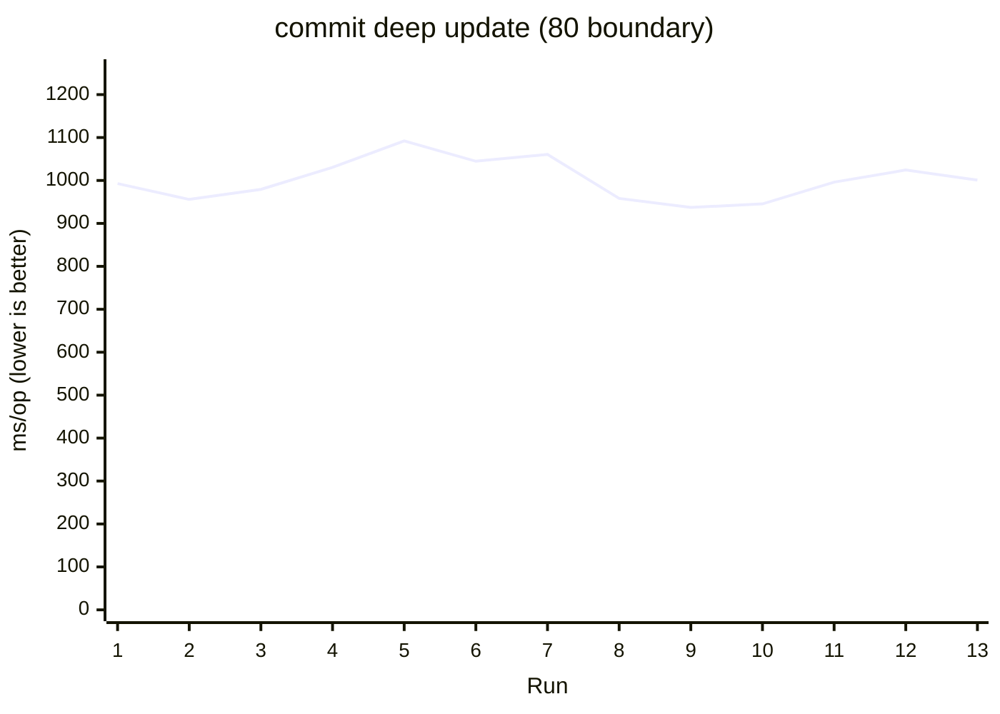
```mermaid
xychart-beta
  title "commit deep update (80 boundary)"
  x-axis "Run" [1, 2, 3, 4, 5, 6, 7, 8, 9, 10, 11, 12, 13]
  y-axis "ms/op (lower is better)" 0 --> 1255.9128
  line [992.725, 955.8344, 979.2947, 1030.485, 1092.0981, 1044.7571, 1060.7891, 958.0996, 937.104, 945.5124, 996.1228, 1024.3481, 1000.8426]
```

### Draft/COW Path

### draft/finish: deep object (200)

- Latest: 4.19 ms/op (lower is better)
- Previous: 4.18
- Delta vs previous (mean): +0.42%

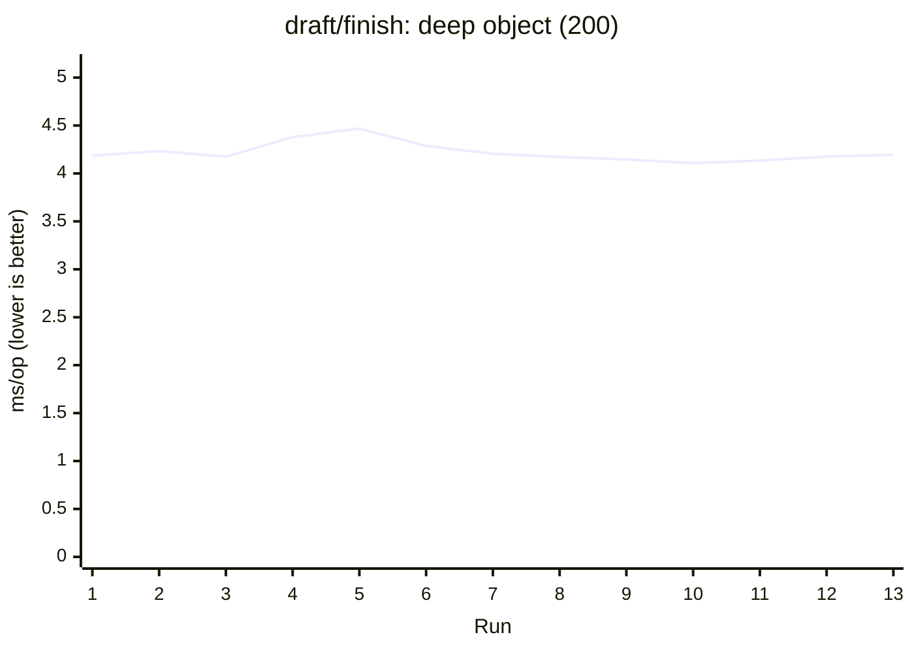
```mermaid
xychart-beta
  title "draft/finish: deep object (200)"
  x-axis "Run" [1, 2, 3, 4, 5, 6, 7, 8, 9, 10, 11, 12, 13]
  y-axis "ms/op (lower is better)" 0 --> 5.1369
  line [4.1858, 4.2331, 4.1749, 4.3797, 4.4669, 4.2879, 4.2048, 4.1722, 4.1463, 4.107, 4.135, 4.1764, 4.1937]
```

### Batch/Concurrency Path

### batch update 200 units

- Latest: 25.95 ms/op (lower is better)
- Previous: 26.32
- Delta vs previous (mean): -1.42%

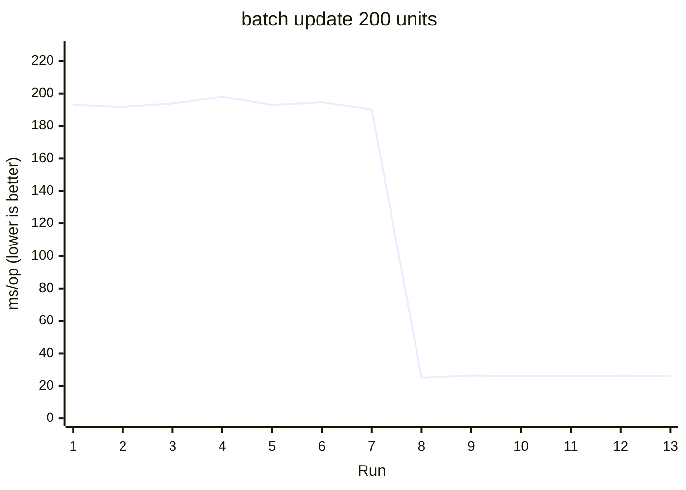
```mermaid
xychart-beta
  title "batch update 200 units"
  x-axis "Run" [1, 2, 3, 4, 5, 6, 7, 8, 9, 10, 11, 12, 13]
  y-axis "ms/op (lower is better)" 0 --> 227.6906
  line [192.8785, 191.6709, 193.7211, 197.9918, 192.8213, 194.4828, 190.106, 25.0751, 26.4239, 26.0522, 25.9361, 26.3187, 25.9458]
```

### no batch: 40k updates

- Latest: 3.95 ms/op (lower is better)
- Previous: 3.92
- Delta vs previous (mean): +0.57%

```mermaid
xychart-beta
  title "no batch: 40k updates"
  x-axis "Run" [1, 2, 3, 4, 5, 6, 7, 8, 9, 10, 11, 12, 13]
  y-axis "ms/op (lower is better)" 0 --> 4.6446
  line [3.7705, 4.0045, 3.9537, 3.919, 3.9399, 3.9601, 4.0328, 3.8328, 4.0388, 3.8705, 3.9188, 3.9234, 3.9458]
```

### sequential update 200 units

- Latest: 19.45 ms/op (lower is better)
- Previous: 19.67
- Delta vs previous (mean): -1.08%

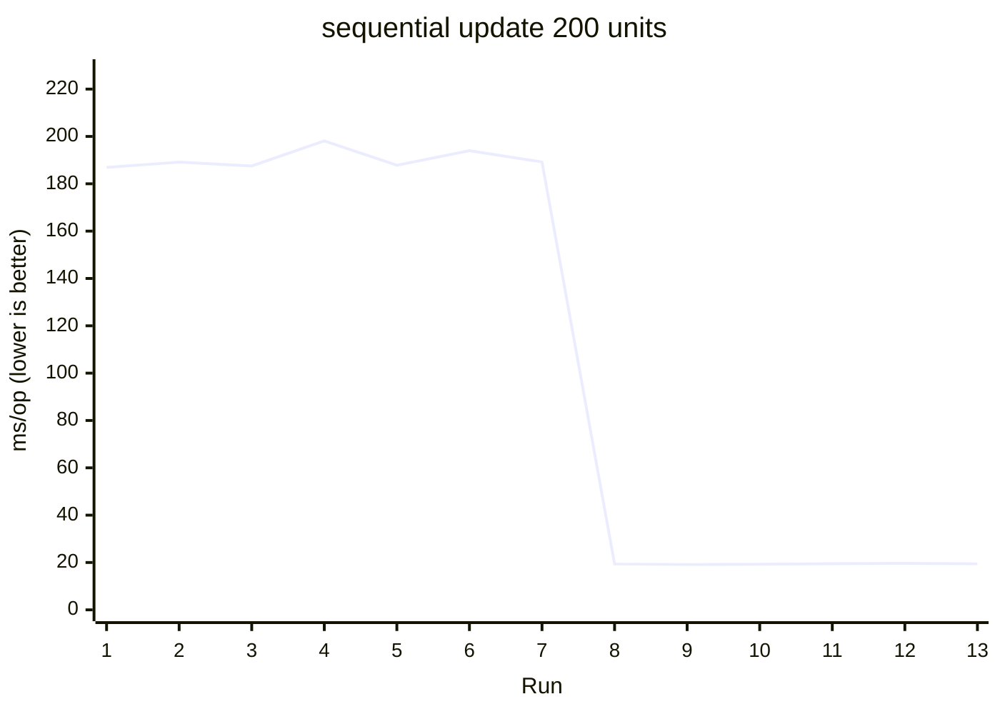
```mermaid
xychart-beta
  title "sequential update 200 units"
  x-axis "Run" [1, 2, 3, 4, 5, 6, 7, 8, 9, 10, 11, 12, 13]
  y-axis "ms/op (lower is better)" 0 --> 227.822
  line [186.9116, 189.1437, 187.5276, 198.1061, 187.8507, 193.992, 189.2093, 19.3745, 19.157, 19.247, 19.5097, 19.665, 19.4525]
```

### General Path

### createUnit: object (1k)

- Latest: 2.00 ms/op (lower is better)
- Previous: 2.02
- Delta vs previous (mean): -0.80%

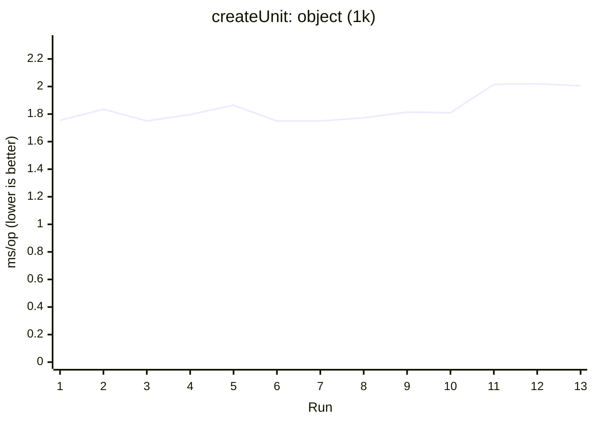
```mermaid
xychart-beta
  title "createUnit: object (1k)"
  x-axis "Run" [1, 2, 3, 4, 5, 6, 7, 8, 9, 10, 11, 12, 13]
  y-axis "ms/op (lower is better)" 0 --> 2.3236
  line [1.7544, 1.8351, 1.7504, 1.7963, 1.8644, 1.7495, 1.7498, 1.7729, 1.8142, 1.8094, 2.0156, 2.0205, 2.0043]
```

### subscribe/unsubscribe: update (10k)

- Latest: 0.25 ms/op (lower is better)
- Previous: 0.25
- Delta vs previous (mean): +1.58%

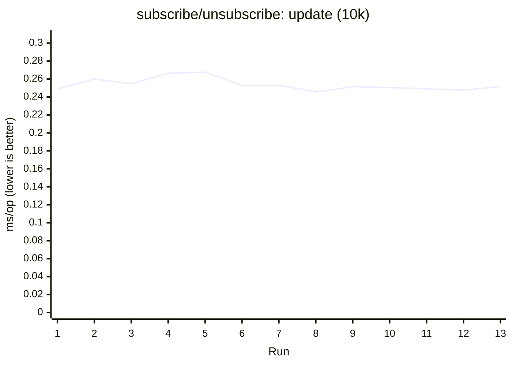
```mermaid
xychart-beta
  title "subscribe/unsubscribe: update (10k)"
  x-axis "Run" [1, 2, 3, 4, 5, 6, 7, 8, 9, 10, 11, 12, 13]
  y-axis "ms/op (lower is better)" 0 --> 0.3077
  line [0.2491, 0.2601, 0.2549, 0.2664, 0.2676, 0.2528, 0.2531, 0.2456, 0.2515, 0.2505, 0.2491, 0.2476, 0.2516]
```

### subscribe/unsubscribe: value (10k)

- Latest: 0.25 ms/op (lower is better)
- Previous: 0.24
- Delta vs previous (mean): +0.64%

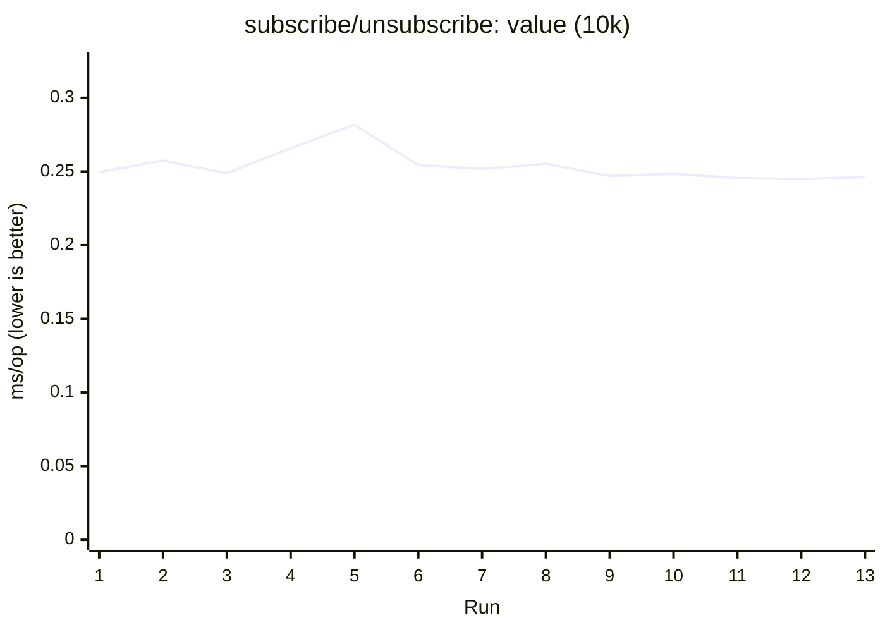
```mermaid
xychart-beta
  title "subscribe/unsubscribe: value (10k)"
  x-axis "Run" [1, 2, 3, 4, 5, 6, 7, 8, 9, 10, 11, 12, 13]
  y-axis "ms/op (lower is better)" 0 --> 0.324
  line [0.2496, 0.2574, 0.2488, 0.2658, 0.2817, 0.2544, 0.2517, 0.2553, 0.2469, 0.2484, 0.2455, 0.2448, 0.2463]
```

### All Scenario Trends (Appendix)

### Snapshot Path

### snapshot: array (10k)

- Latest: 0.87 ms/op (lower is better)
- Previous: 0.88
- Delta vs previous (mean): -0.96%

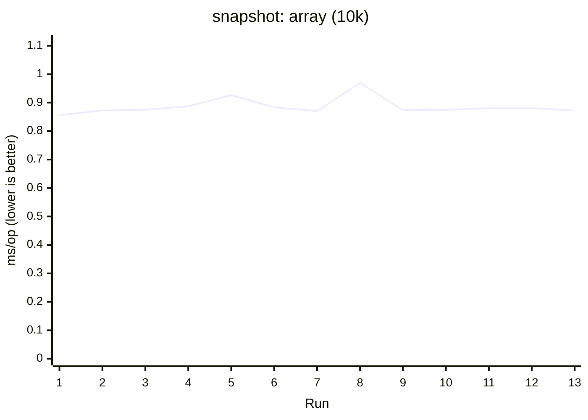
```mermaid
xychart-beta
  title "snapshot: array (10k)"
  x-axis "Run" [1, 2, 3, 4, 5, 6, 7, 8, 9, 10, 11, 12, 13]
  y-axis "ms/op (lower is better)" 0 --> 1.1148
  line [0.8558, 0.8727, 0.8746, 0.8872, 0.9264, 0.8833, 0.8703, 0.9694, 0.8734, 0.8747, 0.8803, 0.8805, 0.8721]
```

### Batch/Concurrency Path

### batch: 40k updates

- Latest: 3.94 ms/op (lower is better)
- Previous: 3.96
- Delta vs previous (mean): -0.49%

```mermaid
xychart-beta
  title "batch: 40k updates"
  x-axis "Run" [1, 2, 3, 4, 5, 6, 7, 8, 9, 10, 11, 12, 13]
  y-axis "ms/op (lower is better)" 0 --> 4.6945
  line [3.7899, 3.981, 3.8937, 3.8797, 3.9636, 3.8868, 4.0624, 3.8737, 4.0822, 3.883, 3.9448, 3.958, 3.9387]
```

### General Path

### createUnit: primitive (1k)

- Latest: 0.80 ms/op (lower is better)
- Previous: 0.82
- Delta vs previous (mean): -2.15%

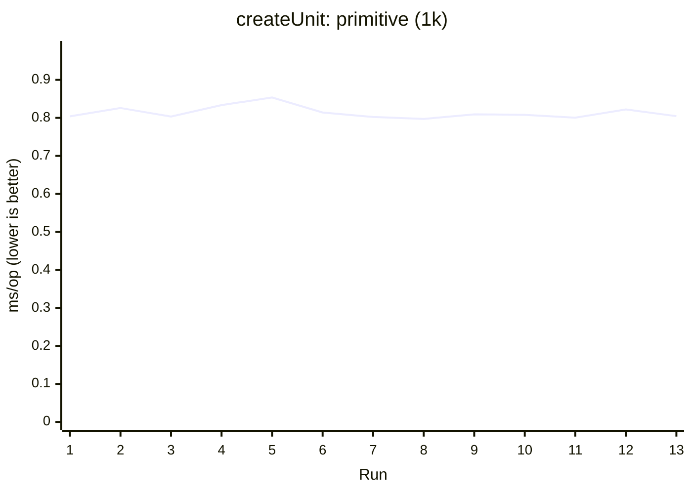
```mermaid
xychart-beta
  title "createUnit: primitive (1k)"
  x-axis "Run" [1, 2, 3, 4, 5, 6, 7, 8, 9, 10, 11, 12, 13]
  y-axis "ms/op (lower is better)" 0 --> 0.9816
  line [0.804, 0.8259, 0.8033, 0.8336, 0.8536, 0.8141, 0.8023, 0.7971, 0.8093, 0.808, 0.8005, 0.8222, 0.8045]
```
