本页由 `nx run apps-docs:generate-bench` 自动生成。

## 运行命令

- 性能基准: `npx nx run @iostore/store:bench -- src/lib/__bench__/core-perf.bench.ts`
- GC/堆增量报告: `npx nx run @iostore/store:bench-gc`

## 最新 GC/堆增量（bench-gc）

| 场景 | 样本数 | 迭代次数 | 中位堆增量 (bytes) | 平均堆增量 (bytes) | P75 堆增量 (bytes) | 中位 bytes/iter | 稳定 bytes/iter |
| --- | --- | --- | --- | --- | --- | --- | --- |
| scope: clean snapshot hit (10k) | 5 | 10000 | 3448 | 3768 | 7520 | 0.34 | 0.34 |
| scope: sparse dirty set-only (2k) | 5 | 2000 | 66744 | 62216 | 95072 | 33.37 | 33.37 |
| scope: sparse dirty set-only cached-handle (2k) | 5 | 2000 | 37200 | 37160 | 43032 | 18.6 | 18.6 |
| scope: sparse dirty + snapshot (2k) | 5 | 2000 | 15072 | 27371 | 48848 | 7.54 | 7.54 |
| scope: dense dirty + snapshot (20 rounds) | 5 | 20 | 0 | 3 | 0 | 0 | 0.15 |
| array: clean snapshot hit (10k) | 5 | 10000 | 5096 | 8874 | 8768 | 0.51 | 0.51 |
| array: sparse dirty set-only (2k) | 5 | 2000 | 285752 | 282394 | 297632 | 142.88 | 142.88 |
| array: sparse dirty set-only cached-handle (2k) | 5 | 2000 | 304752 | 310768 | 315432 | 152.38 | 152.38 |
| array: sparse dirty + snapshot (2k) | 5 | 2000 | 0 | 64278 | 0 | 0 | 32.14 |
| array: dense dirty + snapshot (20 rounds) | 5 | 20 | 0 | 0 | 0 | 0 | 0 |

### 近似拆分（仅方向性参考）

| 场景 | 中位 bytes/iter | 来源指标 | 方法 |
| --- | --- | --- | --- |
| scope: sparse dirty snapshot-only (estimated) | 0 | stableBytesPerIteration | combined - set-only |
| array: sparse dirty snapshot-only (estimated) | 0 | stableBytesPerIteration | combined - set-only |

结果会随硬件、负载与 Node 版本变化。

## 快速结论

### 最慢场景（按 mean）

| 场景 | 最新 mean (ms/op) | 最新 ops/sec | 最新 RME (%) |
| --- | --- | --- | --- |
| commit deep update (80 boundary) | 987.36 | 1.01 | 1.53 |
| snapshot: scope sparse dirty key (1k) | 43.84 | 22.81 | 0.62 |
| snapshot: array (20k boundary) | 39.41 | 25.38 | 1.94 |
| commit deep update (200) | 30.67 | 32.61 | 0.98 |
| batch update 200 units | 28.07 | 35.63 | 1.48 |

### 波动最大场景（按 RME）

| 场景 | 最新 RME (%) | 最新 mean (ms/op) | 最新 ops/sec |
| --- | --- | --- | --- |
| snapshot: scope (10k) | 6.63 | 0.73 | 1367.34 |
| snapshot: array (20k boundary) | 1.94 | 39.41 | 25.38 |
| createUnit: object (1k) | 1.54 | 2.09 | 477.41 |
| commit deep update (80 boundary) | 1.53 | 987.36 | 1.01 |
| batch update 200 units | 1.48 | 28.07 | 35.63 |

### 较上次退化最多场景

| 场景 | 较上次变化 (mean) | 最新 mean (ms/op) | 最新 RME (%) |
| --- | --- | --- | --- |
| snapshot: scope dense dirty keys (1k) | +15.85% | 10.64 | 1.25 |
| snapshot: scope (10k) | +12.55% | 0.73 | 6.63 |
| batch update 200 units | +10.20% | 28.07 | 1.48 |
| commit deep update (200) | +9.93% | 30.67 | 0.98 |
| snapshot: scope sparse dirty key (1k) | +9.92% | 43.84 | 0.62 |

### 较上次改进最多场景

| 场景 | 较上次变化 (mean) | 最新 mean (ms/op) | 最新 RME (%) |
| --- | --- | --- | --- |
| subscribe/unsubscribe: update (10k) | -0.29% | 0.26 | 0.23 |

## 本次运行环境

- Date: 2026-02-15T16:45:33.998Z
- Node: v22.22.0
- Platform: darwin 25.2.0 (arm64)
- CPU: Apple M4
- Benchmark time: 2000ms per task
- Warmup time: 250ms per task

## 运行时间线

| 运行 | 时间 | Node | 平台 |
| --- | --- | --- | --- |
| 1 | 2026-02-15T10:57:02.332Z | v22.22.0 | darwin 25.2.0 (arm64) |
| 2 | 2026-02-15T10:58:08.576Z | v22.22.0 | darwin 25.2.0 (arm64) |
| 3 | 2026-02-15T11:00:45.076Z | v22.22.0 | darwin 25.2.0 (arm64) |
| 4 | 2026-02-15T11:03:51.332Z | v22.22.0 | darwin 25.2.0 (arm64) |
| 5 | 2026-02-15T11:13:27.667Z | v22.22.0 | darwin 25.2.0 (arm64) |
| 6 | 2026-02-15T11:15:33.855Z | v22.22.0 | darwin 25.2.0 (arm64) |
| 7 | 2026-02-15T11:22:12.037Z | v22.22.0 | darwin 25.2.0 (arm64) |
| 8 | 2026-02-15T13:57:47.040Z | v22.22.0 | darwin 25.2.0 (arm64) |
| 9 | 2026-02-15T14:00:53.851Z | v22.22.0 | darwin 25.2.0 (arm64) |
| 10 | 2026-02-15T14:02:58.444Z | v22.22.0 | darwin 25.2.0 (arm64) |
| 11 | 2026-02-15T14:07:57.058Z | v22.22.0 | darwin 25.2.0 (arm64) |
| 12 | 2026-02-15T14:10:14.565Z | v22.22.0 | darwin 25.2.0 (arm64) |
| 13 | 2026-02-15T14:12:05.620Z | v22.22.0 | darwin 25.2.0 (arm64) |
| 14 | 2026-02-15T15:16:53.369Z | v22.22.0 | darwin 25.2.0 (arm64) |
| 15 | 2026-02-15T15:18:28.492Z | v22.22.0 | darwin 25.2.0 (arm64) |
| 16 | 2026-02-15T16:45:33.998Z | v22.22.0 | darwin 25.2.0 (arm64) |

## 最新结果

## 按分组查看最新结果

### Snapshot 路径

| 场景 | 最新 mean (ms/op) | 最新 ops/sec | 最新 RME (%) | 较上次变化 (mean) |
| --- | --- | --- | --- | --- |
| snapshot: array (10k) | 0.91 | 1103.17 | 0.33 | +5.58% |
| snapshot: array (20k boundary) | 39.41 | 25.38 | 1.94 | +8.02% |
| snapshot: depth (80 boundary) | 0.31 | 3268.12 | 0.99 | +7.71% |
| snapshot: scope (10k) | 0.73 | 1367.34 | 6.63 | +12.55% |
| snapshot: scope dense dirty keys (1k) | 10.64 | 94.00 | 1.25 | +15.85% |
| snapshot: scope sparse dirty key (1k) | 43.84 | 22.81 | 0.62 | +9.92% |

### Commit 路径

| 场景 | 最新 mean (ms/op) | 最新 ops/sec | 最新 RME (%) | 较上次变化 (mean) |
| --- | --- | --- | --- | --- |
| commit deep update (200) | 30.67 | 32.61 | 0.98 | +9.93% |
| commit deep update (80 boundary) | 987.36 | 1.01 | 1.53 | +2.84% |

### Draft/COW 路径

| 场景 | 最新 mean (ms/op) | 最新 ops/sec | 最新 RME (%) | 较上次变化 (mean) |
| --- | --- | --- | --- | --- |
| draft/finish: deep object (200) | 4.40 | 227.40 | 0.41 | +6.70% |

### Batch/并发路径

| 场景 | 最新 mean (ms/op) | 最新 ops/sec | 最新 RME (%) | 较上次变化 (mean) |
| --- | --- | --- | --- | --- |
| batch update 200 units | 28.07 | 35.63 | 1.48 | +10.20% |
| batch: 40k updates | 4.02 | 248.82 | 0.24 | +4.45% |
| no batch: 40k updates | 4.01 | 249.15 | 0.11 | +1.91% |
| sequential update 200 units | 20.33 | 49.19 | 0.53 | +5.96% |

### 通用路径

| 场景 | 最新 mean (ms/op) | 最新 ops/sec | 最新 RME (%) | 较上次变化 (mean) |
| --- | --- | --- | --- | --- |
| createUnit: object (1k) | 2.09 | 477.41 | 1.54 | +5.78% |
| createUnit: primitive (1k) | 0.82 | 1217.13 | 0.16 | +1.29% |
| subscribe/unsubscribe: update (10k) | 0.26 | 3907.46 | 0.23 | -0.29% |
| subscribe/unsubscribe: value (10k) | 0.25 | 3944.25 | 0.22 | +3.06% |

## 较上次变化最大场景

| 场景 | 较上次变化 (mean) | 变化幅度 |
| --- | --- | --- |
| snapshot: scope dense dirty keys (1k) | +15.85% | +15.85% |
| snapshot: scope (10k) | +12.55% | +12.55% |
| batch update 200 units | +10.20% | +10.20% |
| commit deep update (200) | +9.93% | +9.93% |
| snapshot: scope sparse dirty key (1k) | +9.92% | +9.92% |
| snapshot: array (20k boundary) | +8.02% | +8.02% |

## 历史趋势（每次 bench 变化）

分组趋势图

### 关键场景趋势

### Snapshot 路径

### snapshot: array (20k boundary)

- 最新： 39.41 ms/op（越低越好）
- 上次： 36.48
- 较上次变化 (mean): +8.02%

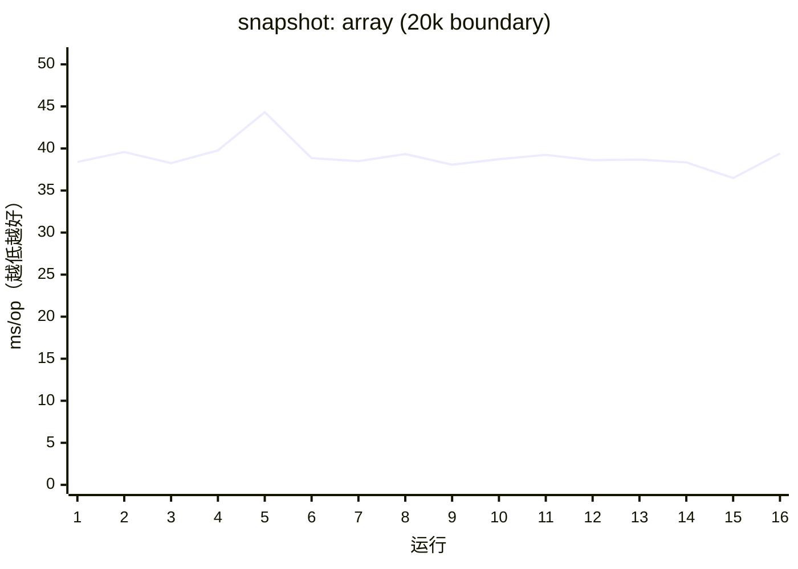
```mermaid
xychart-beta
  title "snapshot: array (20k boundary)"
  x-axis "运行" [1, 2, 3, 4, 5, 6, 7, 8, 9, 10, 11, 12, 13, 14, 15, 16]
  y-axis "ms/op（越低越好）" 0 --> 50.9648
  line [38.3919, 39.5763, 38.256, 39.7677, 44.3172, 38.8518, 38.4879, 39.3373, 38.0714, 38.7314, 39.2405, 38.6115, 38.6693, 38.3462, 36.4813, 39.4055]
```

### snapshot: scope (10k)

- 最新： 0.73 ms/op（越低越好）
- 上次： 0.65
- 较上次变化 (mean): +12.55%

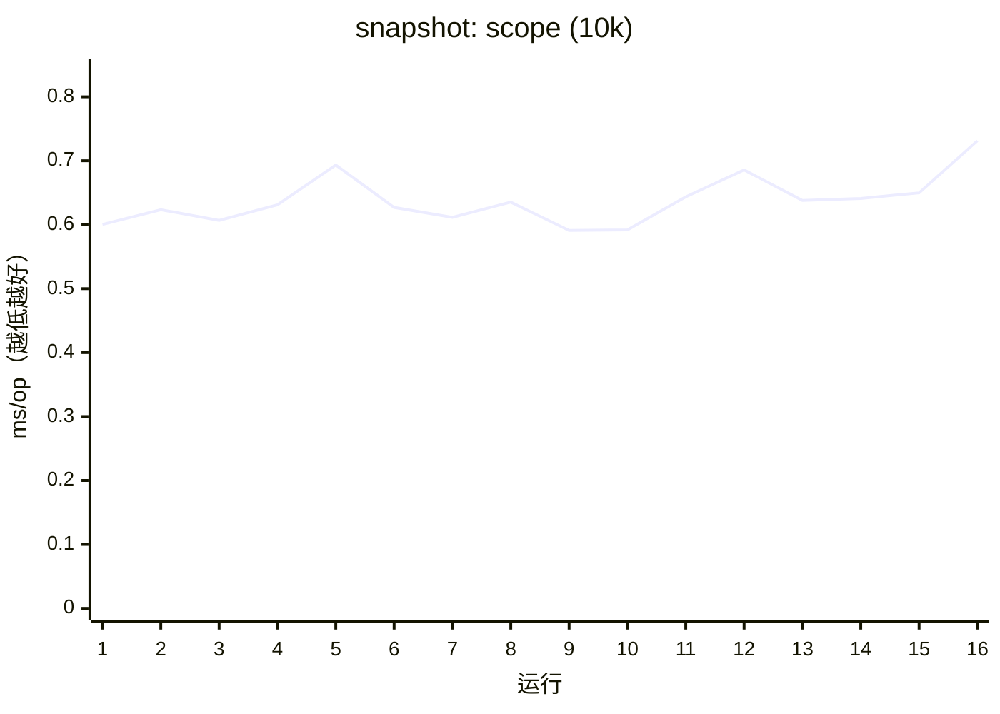
```mermaid
xychart-beta
  title "snapshot: scope (10k)"
  x-axis "运行" [1, 2, 3, 4, 5, 6, 7, 8, 9, 10, 11, 12, 13, 14, 15, 16]
  y-axis "ms/op（越低越好）" 0 --> 0.841
  line [0.6004, 0.6234, 0.6068, 0.631, 0.6934, 0.627, 0.6114, 0.6352, 0.591, 0.5919, 0.6436, 0.6856, 0.638, 0.6411, 0.6498, 0.7313]
```

### snapshot: scope dense dirty keys (1k)

- 最新： 10.64 ms/op（越低越好）
- 上次： 9.18
- 较上次变化 (mean): +15.85%

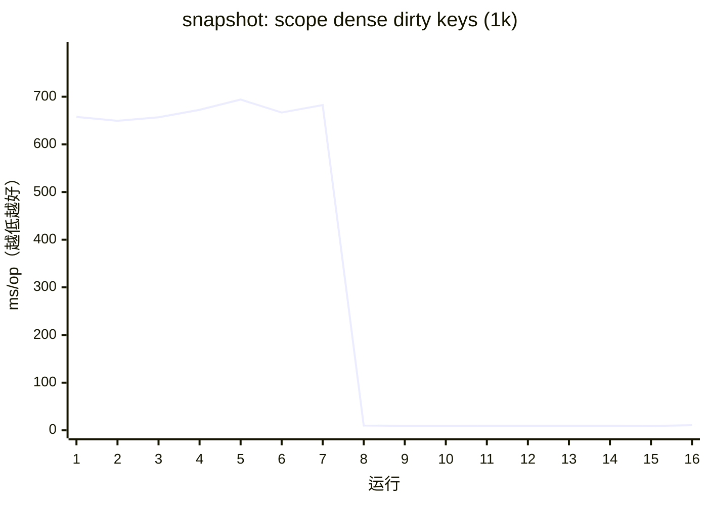
```mermaid
xychart-beta
  title "snapshot: scope dense dirty keys (1k)"
  x-axis "运行" [1, 2, 3, 4, 5, 6, 7, 8, 9, 10, 11, 12, 13, 14, 15, 16]
  y-axis "ms/op（越低越好）" 0 --> 798.196
  line [657.7338, 649.4971, 656.8009, 672.4747, 694.0835, 666.831, 682.4672, 10.0629, 9.4418, 9.3377, 9.5797, 9.7117, 9.6769, 9.6675, 9.1825, 10.6378]
```

### snapshot: scope sparse dirty key (1k)

- 最新： 43.84 ms/op（越低越好）
- 上次： 39.88
- 较上次变化 (mean): +9.92%

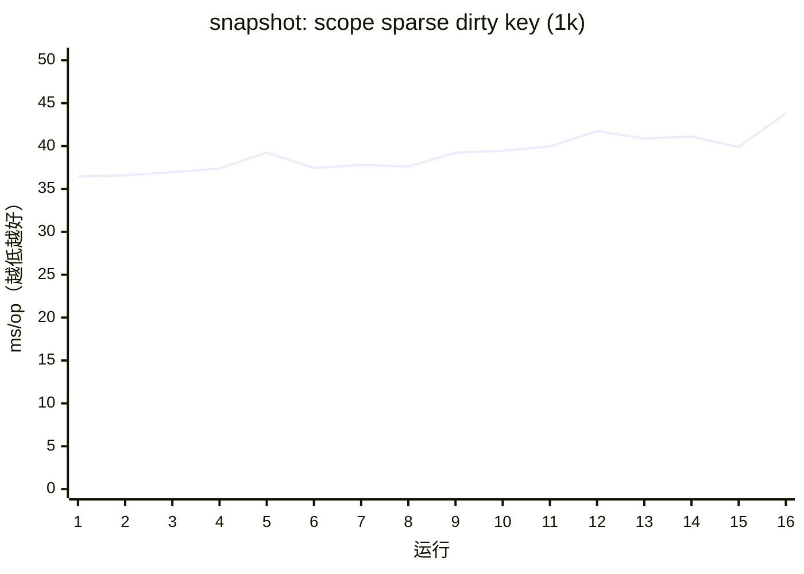
```mermaid
xychart-beta
  title "snapshot: scope sparse dirty key (1k)"
  x-axis "运行" [1, 2, 3, 4, 5, 6, 7, 8, 9, 10, 11, 12, 13, 14, 15, 16]
  y-axis "ms/op（越低越好）" 0 --> 50.4147
  line [36.472, 36.5878, 36.9486, 37.3812, 39.2313, 37.435, 37.7992, 37.6167, 39.2233, 39.4452, 39.9555, 41.7431, 40.8896, 41.0984, 39.8832, 43.8389]
```

### Commit 路径

### commit deep update (200)

- 最新： 30.67 ms/op（越低越好）
- 上次： 27.90
- 较上次变化 (mean): +9.93%

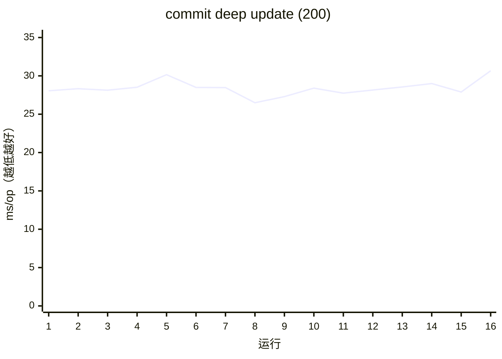
```mermaid
xychart-beta
  title "commit deep update (200)"
  x-axis "运行" [1, 2, 3, 4, 5, 6, 7, 8, 9, 10, 11, 12, 13, 14, 15, 16]
  y-axis "ms/op（越低越好）" 0 --> 35.265
  line [28.0546, 28.3256, 28.128, 28.518, 30.1533, 28.4924, 28.468, 26.4901, 27.2909, 28.402, 27.747, 28.1575, 28.549, 28.9993, 27.8953, 30.6652]
```

### commit deep update (80 boundary)

- 最新： 987.36 ms/op（越低越好）
- 上次： 960.08
- 较上次变化 (mean): +2.84%

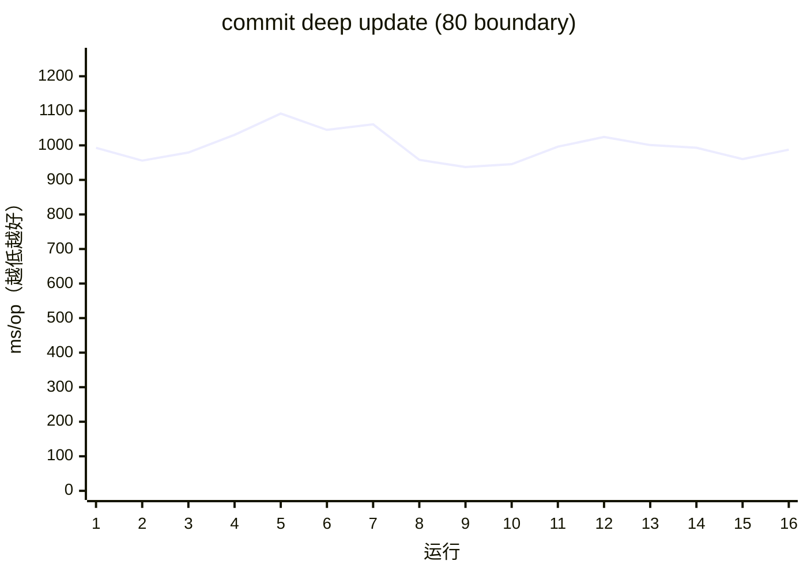
```mermaid
xychart-beta
  title "commit deep update (80 boundary)"
  x-axis "运行" [1, 2, 3, 4, 5, 6, 7, 8, 9, 10, 11, 12, 13, 14, 15, 16]
  y-axis "ms/op（越低越好）" 0 --> 1255.9128
  line [992.725, 955.8344, 979.2947, 1030.485, 1092.0981, 1044.7571, 1060.7891, 958.0996, 937.104, 945.5124, 996.1228, 1024.3481, 1000.8426, 993.1195, 960.0815, 987.3555]
```

### Draft/COW 路径

### draft/finish: deep object (200)

- 最新： 4.40 ms/op（越低越好）
- 上次： 4.12
- 较上次变化 (mean): +6.70%

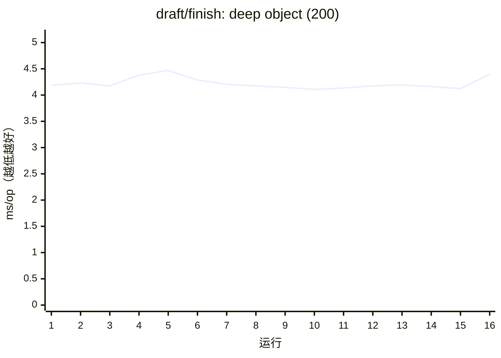
```mermaid
xychart-beta
  title "draft/finish: deep object (200)"
  x-axis "运行" [1, 2, 3, 4, 5, 6, 7, 8, 9, 10, 11, 12, 13, 14, 15, 16]
  y-axis "ms/op（越低越好）" 0 --> 5.1369
  line [4.1858, 4.2331, 4.1749, 4.3797, 4.4669, 4.2879, 4.2048, 4.1722, 4.1463, 4.107, 4.135, 4.1764, 4.1937, 4.1622, 4.1215, 4.3975]
```

### Batch/并发路径

### batch update 200 units

- 最新： 28.07 ms/op（越低越好）
- 上次： 25.47
- 较上次变化 (mean): +10.20%

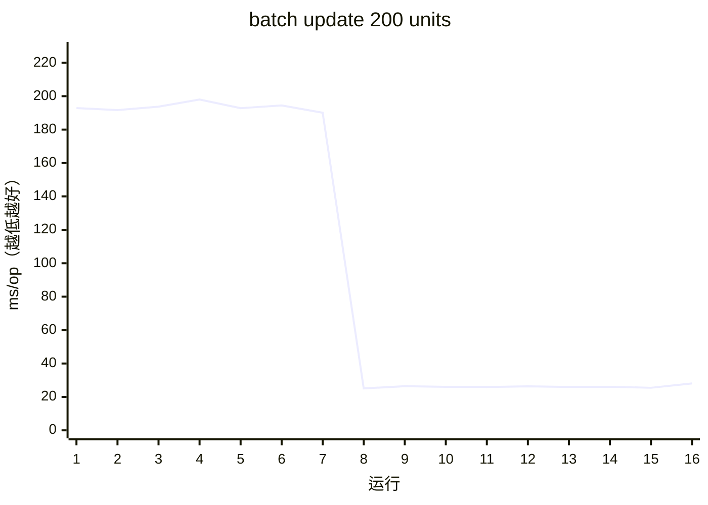
```mermaid
xychart-beta
  title "batch update 200 units"
  x-axis "运行" [1, 2, 3, 4, 5, 6, 7, 8, 9, 10, 11, 12, 13, 14, 15, 16]
  y-axis "ms/op（越低越好）" 0 --> 227.6906
  line [192.8785, 191.6709, 193.7211, 197.9918, 192.8213, 194.4828, 190.106, 25.0751, 26.4239, 26.0522, 25.9361, 26.3187, 25.9458, 26.0771, 25.4667, 28.0652]
```

### sequential update 200 units

- 最新： 20.33 ms/op（越低越好）
- 上次： 19.19
- 较上次变化 (mean): +5.96%

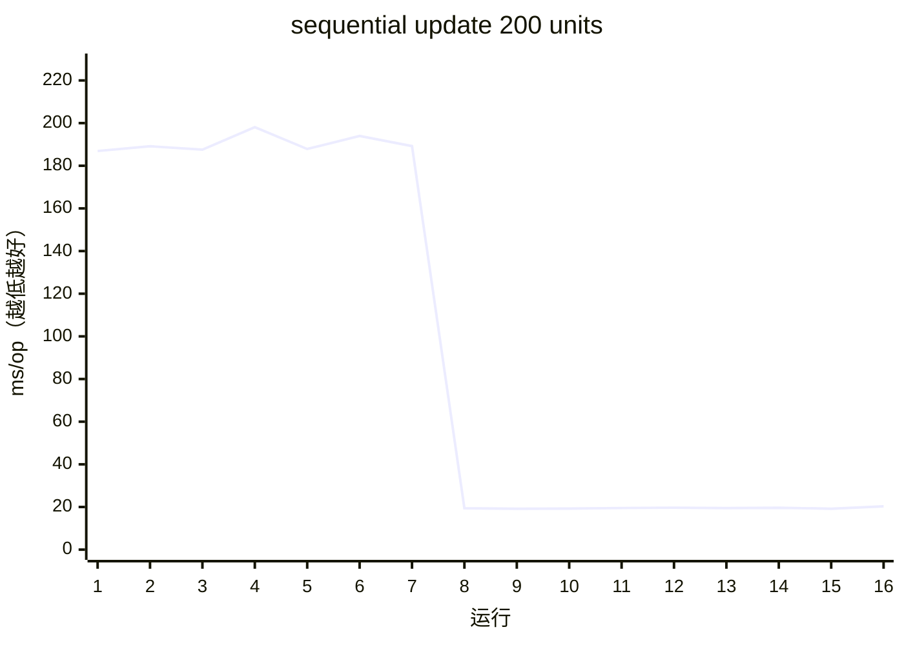
```mermaid
xychart-beta
  title "sequential update 200 units"
  x-axis "运行" [1, 2, 3, 4, 5, 6, 7, 8, 9, 10, 11, 12, 13, 14, 15, 16]
  y-axis "ms/op（越低越好）" 0 --> 227.822
  line [186.9116, 189.1437, 187.5276, 198.1061, 187.8507, 193.992, 189.2093, 19.3745, 19.157, 19.247, 19.5097, 19.665, 19.4525, 19.6475, 19.1882, 20.3313]
```

### 通用路径

### createUnit: object (1k)

- 最新： 2.09 ms/op（越低越好）
- 上次： 1.98
- 较上次变化 (mean): +5.78%

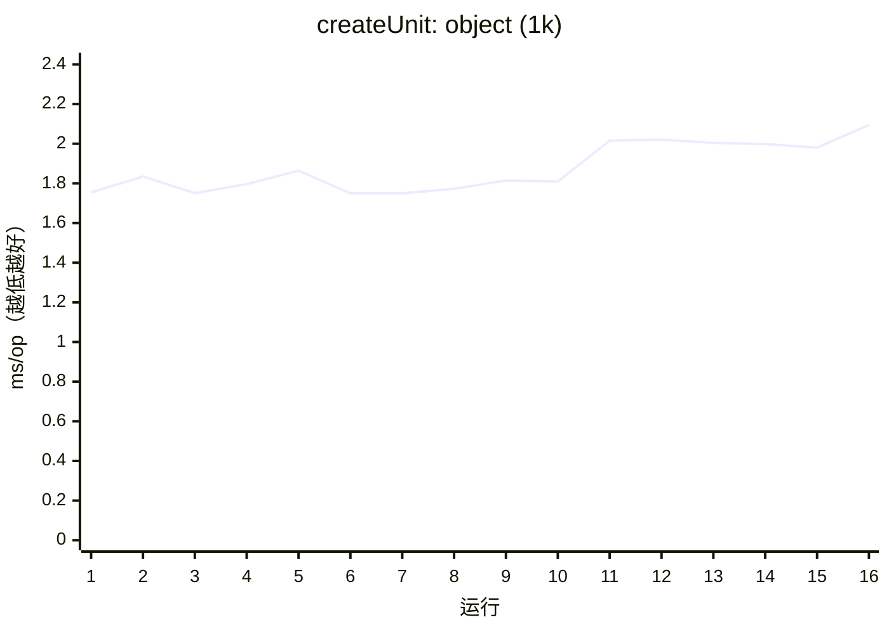
```mermaid
xychart-beta
  title "createUnit: object (1k)"
  x-axis "运行" [1, 2, 3, 4, 5, 6, 7, 8, 9, 10, 11, 12, 13, 14, 15, 16]
  y-axis "ms/op（越低越好）" 0 --> 2.4088
  line [1.7544, 1.8351, 1.7504, 1.7963, 1.8644, 1.7495, 1.7498, 1.7729, 1.8142, 1.8094, 2.0156, 2.0205, 2.0043, 1.9985, 1.9802, 2.0946]
```

### 全部场景趋势（附录）

### Snapshot 路径

### snapshot: array (10k)

- 最新： 0.91 ms/op（越低越好）
- 上次： 0.86
- 较上次变化 (mean): +5.58%

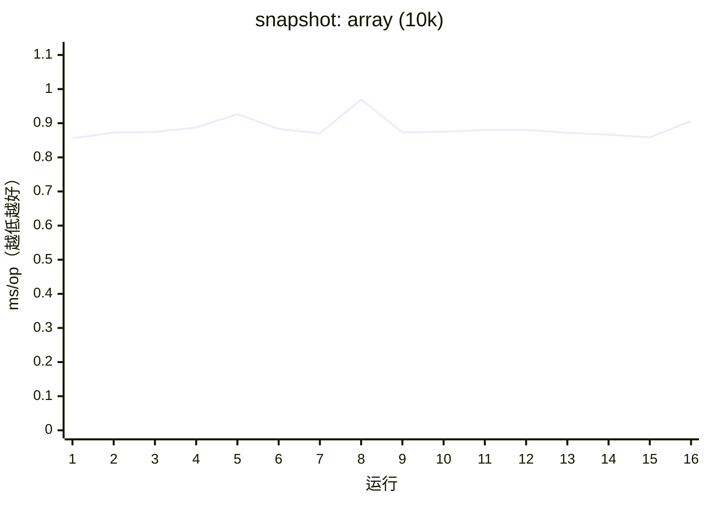
```mermaid
xychart-beta
  title "snapshot: array (10k)"
  x-axis "运行" [1, 2, 3, 4, 5, 6, 7, 8, 9, 10, 11, 12, 13, 14, 15, 16]
  y-axis "ms/op（越低越好）" 0 --> 1.1148
  line [0.8558, 0.8727, 0.8746, 0.8872, 0.9264, 0.8833, 0.8703, 0.9694, 0.8734, 0.8747, 0.8803, 0.8805, 0.8721, 0.8662, 0.8586, 0.9065]
```

### snapshot: depth (80 boundary)

- 最新： 0.31 ms/op（越低越好）
- 上次： 0.28
- 较上次变化 (mean): +7.71%

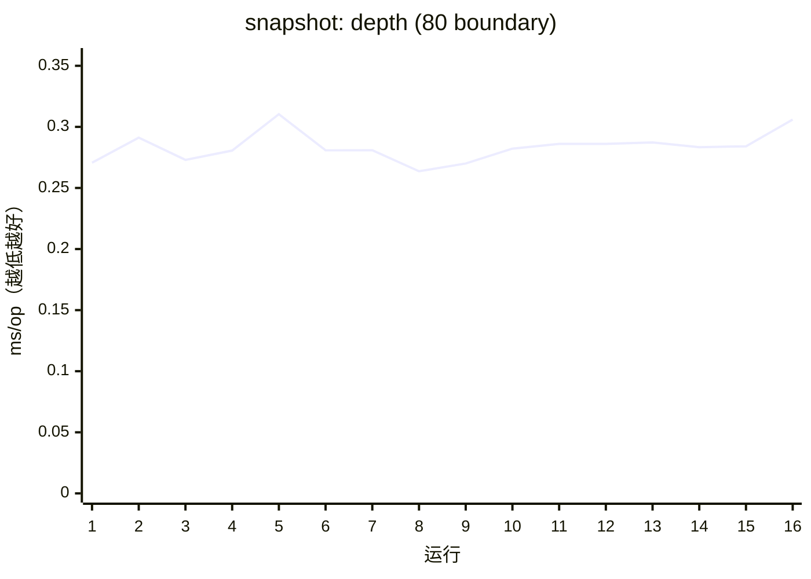
```mermaid
xychart-beta
  title "snapshot: depth (80 boundary)"
  x-axis "运行" [1, 2, 3, 4, 5, 6, 7, 8, 9, 10, 11, 12, 13, 14, 15, 16]
  y-axis "ms/op（越低越好）" 0 --> 0.357
  line [0.2707, 0.2912, 0.273, 0.2806, 0.3104, 0.2808, 0.2809, 0.2637, 0.27, 0.2822, 0.2861, 0.2861, 0.2873, 0.2834, 0.2841, 0.306]
```

### Batch/并发路径

### batch: 40k updates

- 最新： 4.02 ms/op（越低越好）
- 上次： 3.85
- 较上次变化 (mean): +4.45%

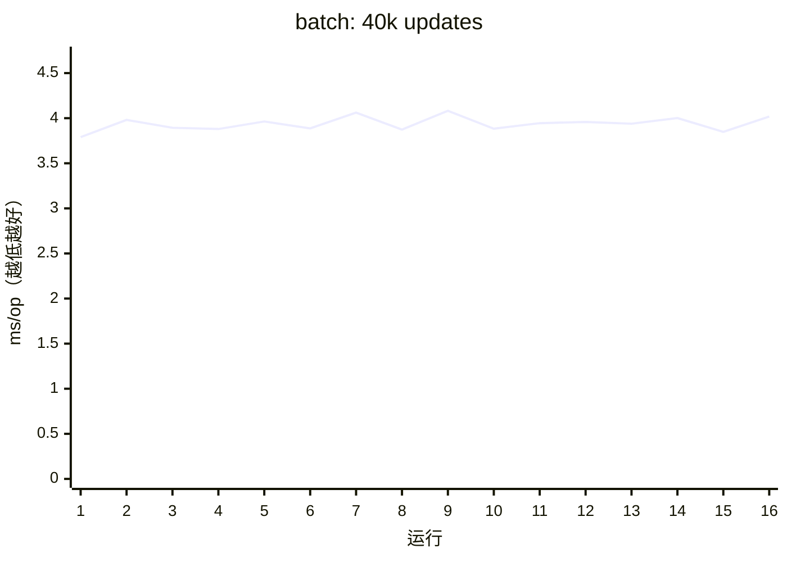
```mermaid
xychart-beta
  title "batch: 40k updates"
  x-axis "运行" [1, 2, 3, 4, 5, 6, 7, 8, 9, 10, 11, 12, 13, 14, 15, 16]
  y-axis "ms/op（越低越好）" 0 --> 4.6945
  line [3.7899, 3.981, 3.8937, 3.8797, 3.9636, 3.8868, 4.0624, 3.8737, 4.0822, 3.883, 3.9448, 3.958, 3.9387, 4.0018, 3.8479, 4.0189]
```

### no batch: 40k updates

- 最新： 4.01 ms/op（越低越好）
- 上次： 3.94
- 较上次变化 (mean): +1.91%

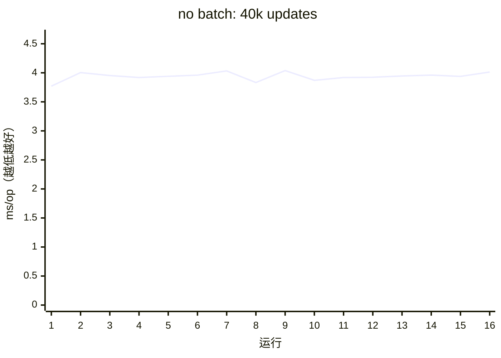
```mermaid
xychart-beta
  title "no batch: 40k updates"
  x-axis "运行" [1, 2, 3, 4, 5, 6, 7, 8, 9, 10, 11, 12, 13, 14, 15, 16]
  y-axis "ms/op（越低越好）" 0 --> 4.6446
  line [3.7705, 4.0045, 3.9537, 3.919, 3.9399, 3.9601, 4.0328, 3.8328, 4.0388, 3.8705, 3.9188, 3.9234, 3.9458, 3.9604, 3.9385, 4.0136]
```

### 通用路径

### createUnit: primitive (1k)

- 最新： 0.82 ms/op（越低越好）
- 上次： 0.81
- 较上次变化 (mean): +1.29%

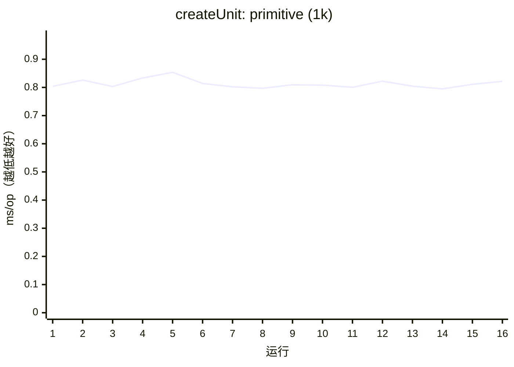
```mermaid
xychart-beta
  title "createUnit: primitive (1k)"
  x-axis "运行" [1, 2, 3, 4, 5, 6, 7, 8, 9, 10, 11, 12, 13, 14, 15, 16]
  y-axis "ms/op（越低越好）" 0 --> 0.9816
  line [0.804, 0.8259, 0.8033, 0.8336, 0.8536, 0.8141, 0.8023, 0.7971, 0.8093, 0.808, 0.8005, 0.8222, 0.8045, 0.7948, 0.8111, 0.8216]
```

### subscribe/unsubscribe: update (10k)

- 最新： 0.26 ms/op（越低越好）
- 上次： 0.26
- 较上次变化 (mean): -0.29%

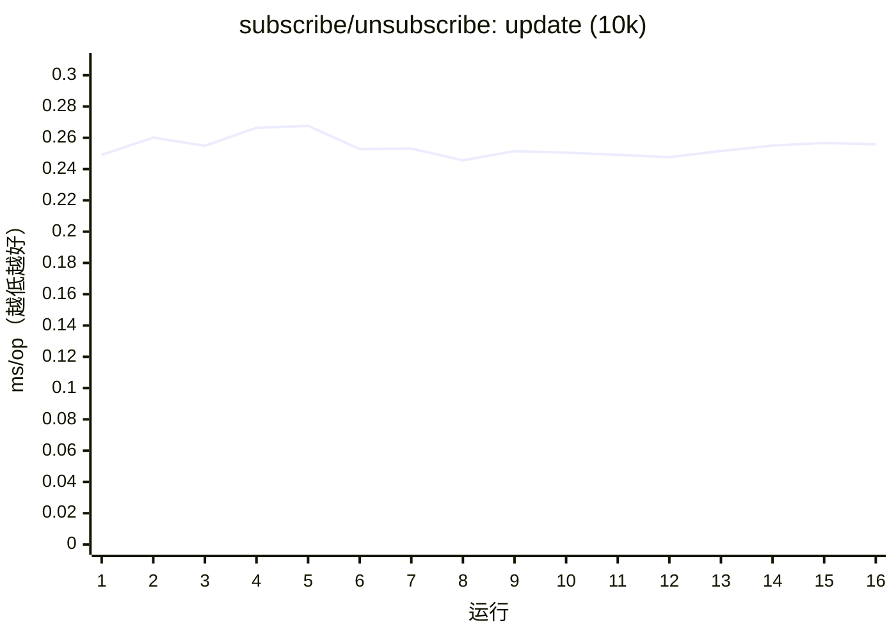
```mermaid
xychart-beta
  title "subscribe/unsubscribe: update (10k)"
  x-axis "运行" [1, 2, 3, 4, 5, 6, 7, 8, 9, 10, 11, 12, 13, 14, 15, 16]
  y-axis "ms/op（越低越好）" 0 --> 0.3077
  line [0.2491, 0.2601, 0.2549, 0.2664, 0.2676, 0.2528, 0.2531, 0.2456, 0.2515, 0.2505, 0.2491, 0.2476, 0.2516, 0.255, 0.2567, 0.2559]
```

### subscribe/unsubscribe: value (10k)

- 最新： 0.25 ms/op（越低越好）
- 上次： 0.25
- 较上次变化 (mean): +3.06%

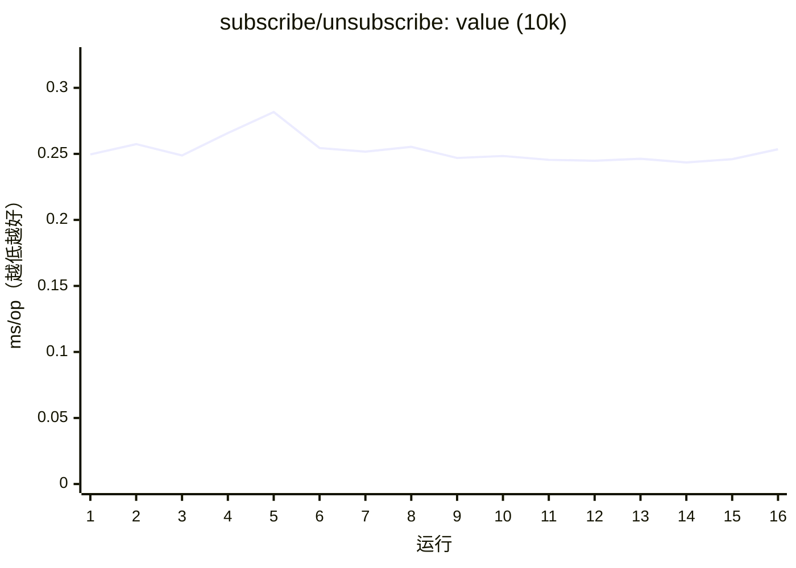
```mermaid
xychart-beta
  title "subscribe/unsubscribe: value (10k)"
  x-axis "运行" [1, 2, 3, 4, 5, 6, 7, 8, 9, 10, 11, 12, 13, 14, 15, 16]
  y-axis "ms/op（越低越好）" 0 --> 0.324
  line [0.2496, 0.2574, 0.2488, 0.2658, 0.2817, 0.2544, 0.2517, 0.2553, 0.2469, 0.2484, 0.2455, 0.2448, 0.2463, 0.2435, 0.246, 0.2535]
```
