本页由 `nx run apps-docs:generate-bench` 自动生成。

结果会随硬件、负载与 Node 版本变化。

## 本次运行环境

- Date: 2026-02-15T11:22:12.037Z
- Node: v22.22.0
- Platform: darwin 25.2.0 (arm64)
- CPU: Apple M4
- Benchmark time: 2000ms per task
- Warmup time: 250ms per task

## 运行时间线

| 运行 | 时间 | Node | 平台 |
| --- | --- | --- | --- |
| 1 | 2026-02-15T10:57:02.332Z | v22.22.0 | darwin 25.2.0 (arm64) |
| 2 | 2026-02-15T10:58:08.576Z | v22.22.0 | darwin 25.2.0 (arm64) |
| 3 | 2026-02-15T11:00:45.076Z | v22.22.0 | darwin 25.2.0 (arm64) |
| 4 | 2026-02-15T11:03:51.332Z | v22.22.0 | darwin 25.2.0 (arm64) |
| 5 | 2026-02-15T11:13:27.667Z | v22.22.0 | darwin 25.2.0 (arm64) |
| 6 | 2026-02-15T11:15:33.855Z | v22.22.0 | darwin 25.2.0 (arm64) |
| 7 | 2026-02-15T11:22:12.037Z | v22.22.0 | darwin 25.2.0 (arm64) |

## 最新结果

| 场景 | 最新 mean (ms/op) | 最新 ops/sec | 较上次变化 (mean) |
| --- | --- | --- | --- |
| createUnit: primitive (1k) | 0.80 | 1246.36 | -1.45% |
| createUnit: object (1k) | 1.75 | 571.49 | +0.02% |
| subscribe/unsubscribe: value (10k) | 0.25 | 3973.08 | -1.08% |
| subscribe/unsubscribe: update (10k) | 0.25 | 3950.81 | +0.14% |
| snapshot: scope (10k) | 0.61 | 1635.60 | -2.49% |
| snapshot: array (10k) | 0.87 | 1149.09 | -1.47% |
| snapshot: array (20k boundary) | 38.49 | 25.98 | -0.94% |
| snapshot: depth (80 boundary) | 0.28 | 3560.44 | +0.04% |
| snapshot: scope sparse dirty key (1k) | 37.80 | 26.46 | +0.97% |
| snapshot: scope dense dirty keys (1k) | 682.47 | 1.47 | +2.34% |
| draft/finish: deep object (200) | 4.20 | 237.82 | -1.94% |
| commit deep update (200) | 28.47 | 35.13 | -0.09% |
| commit deep update (80 boundary) | 1060.79 | 0.94 | +1.53% |
| batch: 40k updates | 4.06 | 246.16 | +4.52% |
| no batch: 40k updates | 4.03 | 247.96 | +1.84% |
| batch update 200 units | 190.11 | 5.26 | -2.25% |
| sequential update 200 units | 189.21 | 5.29 | -2.47% |

## 较上次变化最大场景

| 场景 | 较上次变化 (mean) | 变化幅度 |
| --- | --- | --- |
| batch: 40k updates | +4.52% | +4.52% |
| snapshot: scope (10k) | -2.49% | +2.49% |
| sequential update 200 units | -2.47% | +2.47% |
| snapshot: scope dense dirty keys (1k) | +2.34% | +2.34% |
| batch update 200 units | -2.25% | +2.25% |
| draft/finish: deep object (200) | -1.94% | +1.94% |

## 历史趋势（每次 bench 变化）

分组趋势图

### Snapshot 路径

### snapshot: array (10k)

- 最新： 0.87 ms/op（越低越好）
- 上次： 0.88
- 较上次变化 (mean): -1.47%

```mermaid
xychart-beta
  title "snapshot: array (10k)"
  x-axis "运行" [1, 2, 3, 4, 5, 6, 7]
  y-axis "ms/op（越低越好）" 0 --> 1.0654
  line [0.8558, 0.8727, 0.8746, 0.8872, 0.9264, 0.8833, 0.8703]
```

### snapshot: array (20k boundary)

- 最新： 38.49 ms/op（越低越好）
- 上次： 38.85
- 较上次变化 (mean): -0.94%

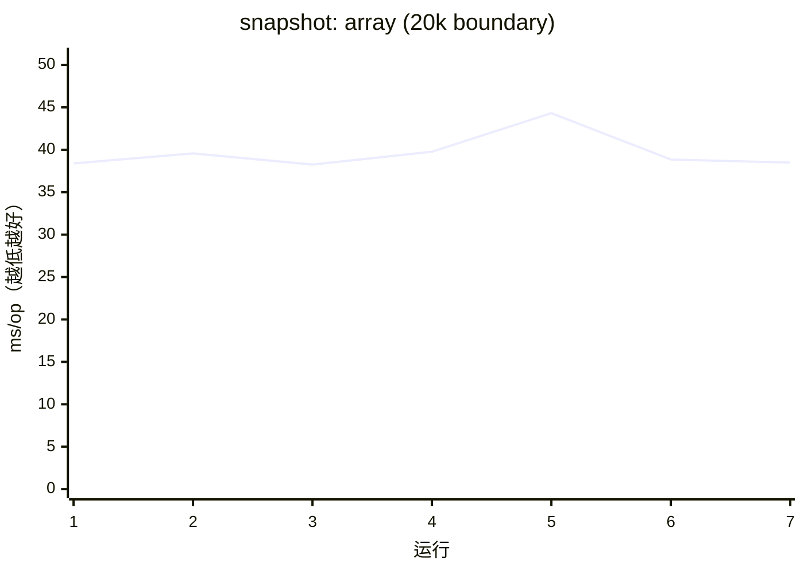

### snapshot: depth (80 boundary)

- 最新： 0.28 ms/op（越低越好）
- 上次： 0.28
- 较上次变化 (mean): +0.04%

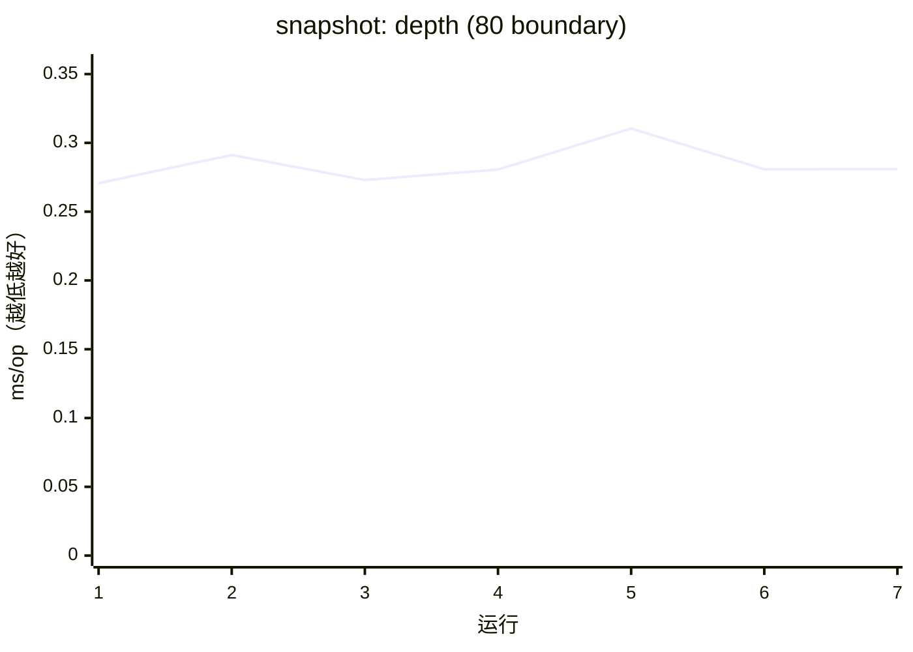

### snapshot: scope (10k)

- 最新： 0.61 ms/op（越低越好）
- 上次： 0.63
- 较上次变化 (mean): -2.49%

```mermaid
xychart-beta
  title "snapshot: scope (10k)"
  x-axis "运行" [1, 2, 3, 4, 5, 6, 7]
  y-axis "ms/op（越低越好）" 0 --> 0.7974
  line [0.6004, 0.6234, 0.6068, 0.631, 0.6934, 0.627, 0.6114]
```

### snapshot: scope dense dirty keys (1k)

- 最新： 682.47 ms/op（越低越好）
- 上次： 666.83
- 较上次变化 (mean): +2.34%

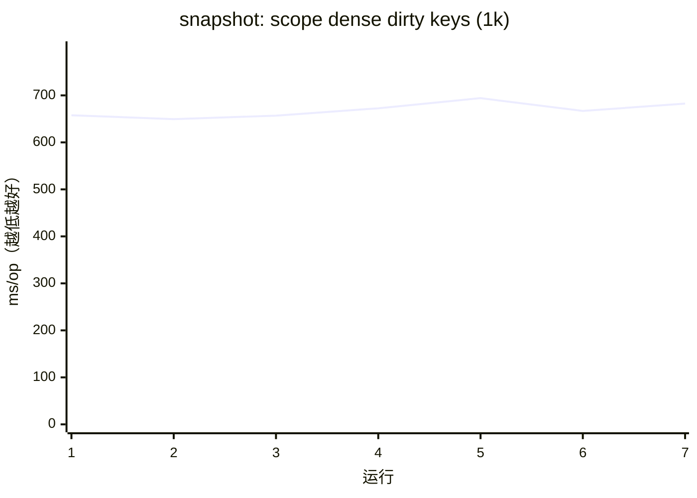

### snapshot: scope sparse dirty key (1k)

- 最新： 37.80 ms/op（越低越好）
- 上次： 37.43
- 较上次变化 (mean): +0.97%

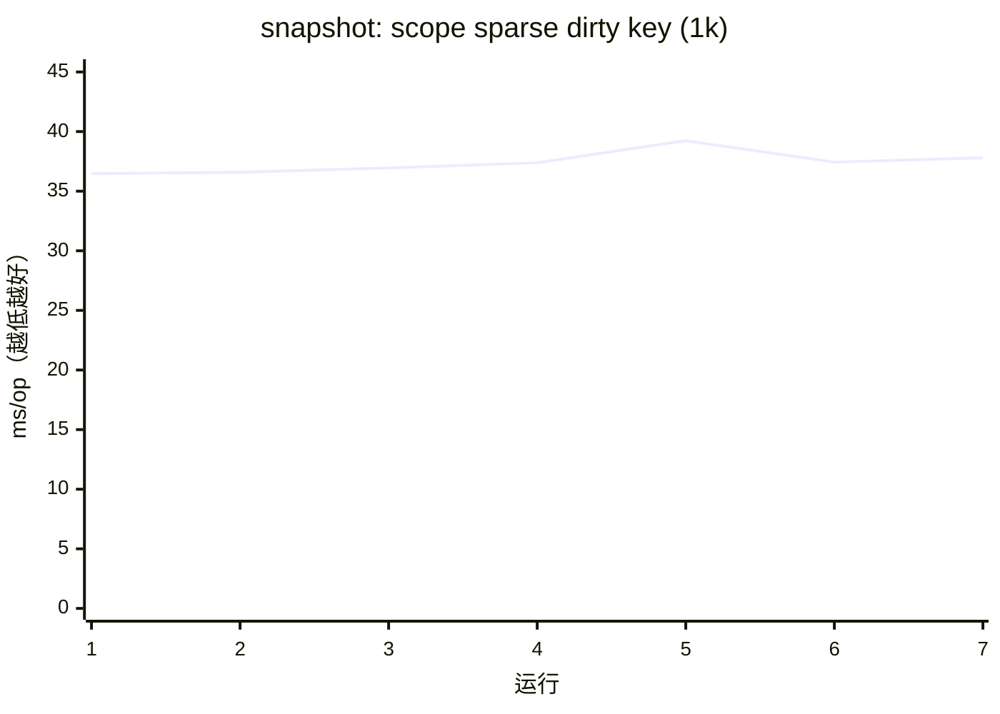

### Commit 路径

### commit deep update (200)

- 最新： 28.47 ms/op（越低越好）
- 上次： 28.49
- 较上次变化 (mean): -0.09%

```mermaid
xychart-beta
  title "commit deep update (200)"
  x-axis "运行" [1, 2, 3, 4, 5, 6, 7]
  y-axis "ms/op（越低越好）" 0 --> 34.6763
  line [28.0546, 28.3256, 28.128, 28.518, 30.1533, 28.4924, 28.468]
```

### commit deep update (80 boundary)

- 最新： 1060.79 ms/op（越低越好）
- 上次： 1044.76
- 较上次变化 (mean): +1.53%

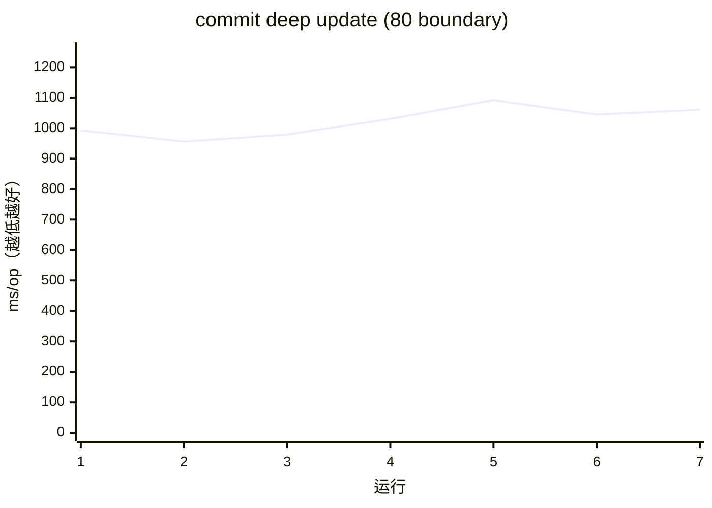

### Draft/COW 路径

### draft/finish: deep object (200)

- 最新： 4.20 ms/op（越低越好）
- 上次： 4.29
- 较上次变化 (mean): -1.94%

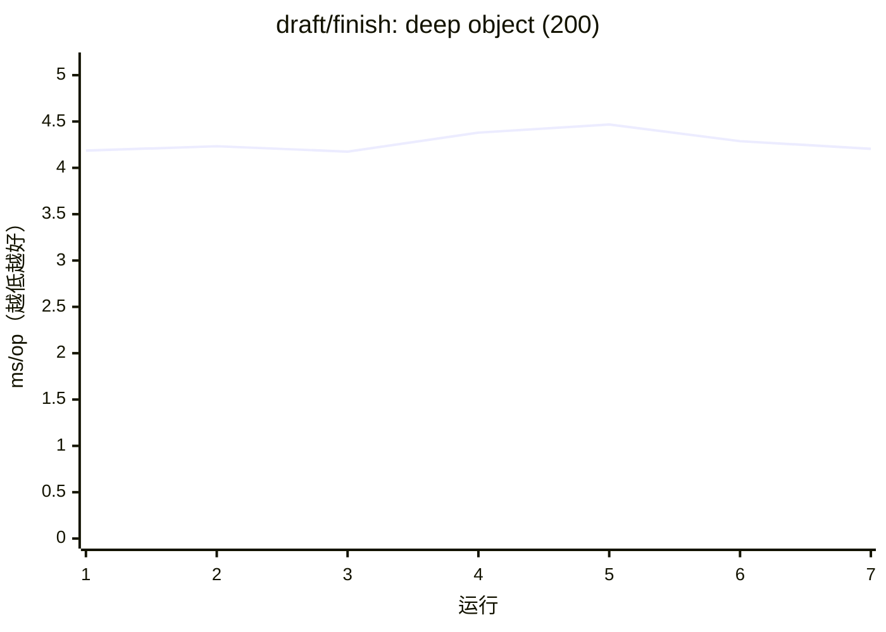

### Batch/并发路径

### batch update 200 units

- 最新： 190.11 ms/op（越低越好）
- 上次： 194.48
- 较上次变化 (mean): -2.25%

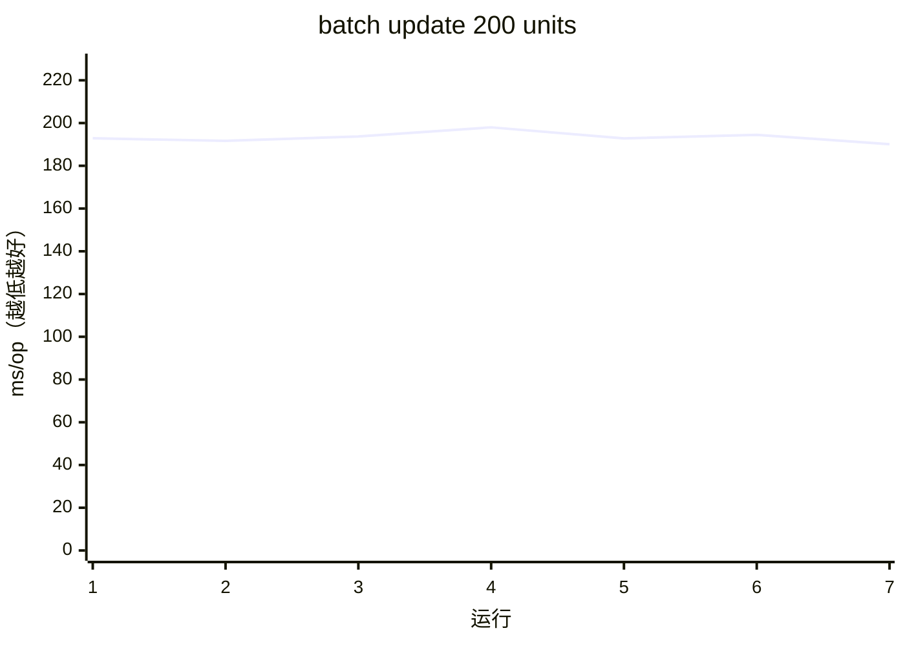

### batch: 40k updates

- 最新： 4.06 ms/op（越低越好）
- 上次： 3.89
- 较上次变化 (mean): +4.52%

```mermaid
xychart-beta
  title "batch: 40k updates"
  x-axis "运行" [1, 2, 3, 4, 5, 6, 7]
  y-axis "ms/op（越低越好）" 0 --> 4.6718
  line [3.7899, 3.981, 3.8937, 3.8797, 3.9636, 3.8868, 4.0624]
```

### no batch: 40k updates

- 最新： 4.03 ms/op（越低越好）
- 上次： 3.96
- 较上次变化 (mean): +1.84%

```mermaid
xychart-beta
  title "no batch: 40k updates"
  x-axis "运行" [1, 2, 3, 4, 5, 6, 7]
  y-axis "ms/op（越低越好）" 0 --> 4.6377
  line [3.7705, 4.0045, 3.9537, 3.919, 3.9399, 3.9601, 4.0328]
```

### sequential update 200 units

- 最新： 189.21 ms/op（越低越好）
- 上次： 193.99
- 较上次变化 (mean): -2.47%

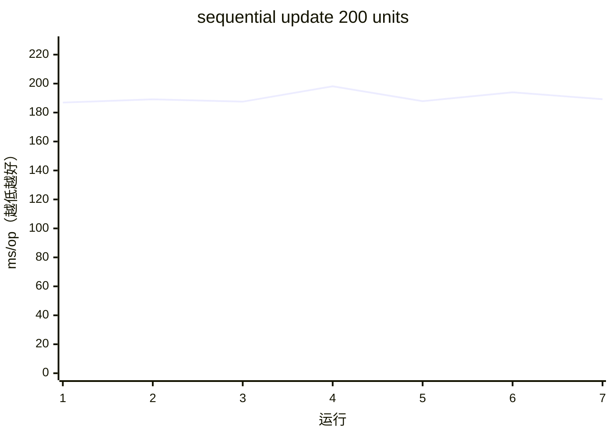

### 通用路径

### createUnit: object (1k)

- 最新： 1.75 ms/op（越低越好）
- 上次： 1.75
- 较上次变化 (mean): +0.02%

```mermaid
xychart-beta
  title "createUnit: object (1k)"
  x-axis "运行" [1, 2, 3, 4, 5, 6, 7]
  y-axis "ms/op（越低越好）" 0 --> 2.1441
  line [1.7544, 1.8351, 1.7504, 1.7963, 1.8644, 1.7495, 1.7498]
```

### createUnit: primitive (1k)

- 最新： 0.80 ms/op（越低越好）
- 上次： 0.81
- 较上次变化 (mean): -1.45%

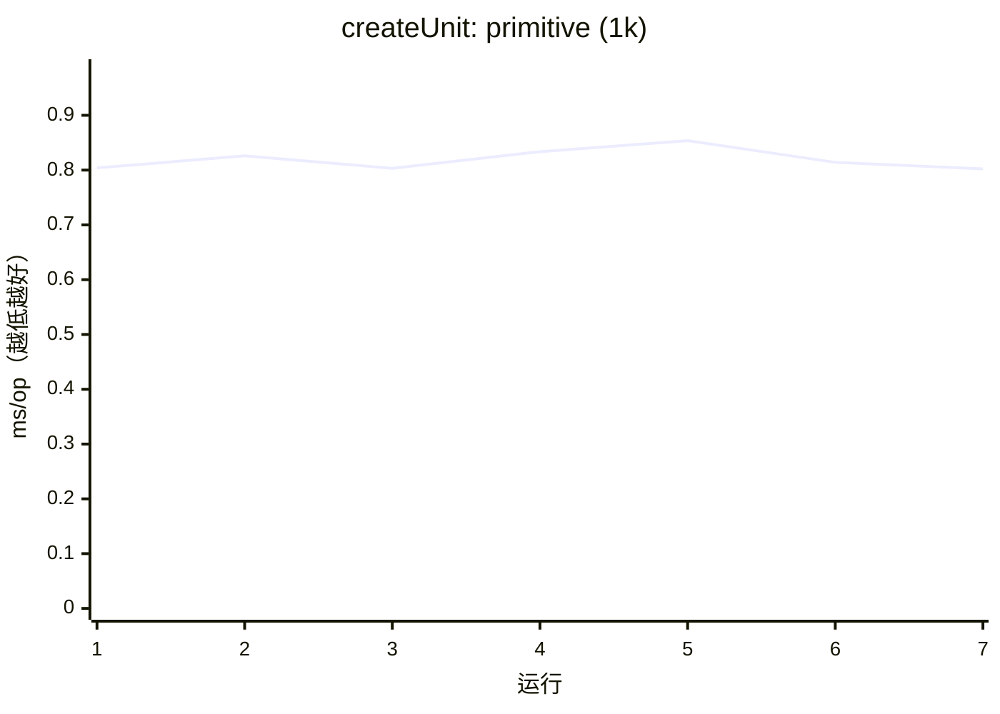

### subscribe/unsubscribe: update (10k)

- 最新： 0.25 ms/op（越低越好）
- 上次： 0.25
- 较上次变化 (mean): +0.14%

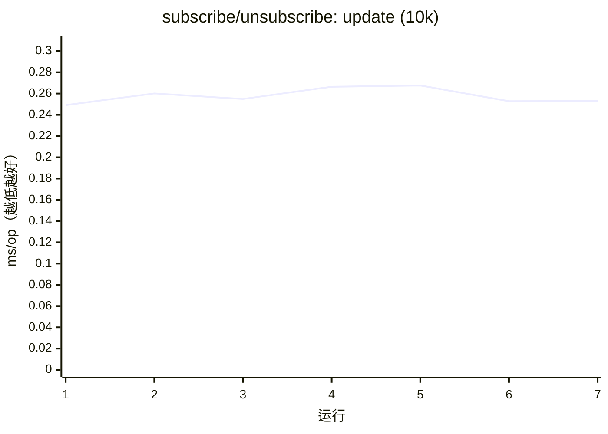

### subscribe/unsubscribe: value (10k)

- 最新： 0.25 ms/op（越低越好）
- 上次： 0.25
- 较上次变化 (mean): -1.08%

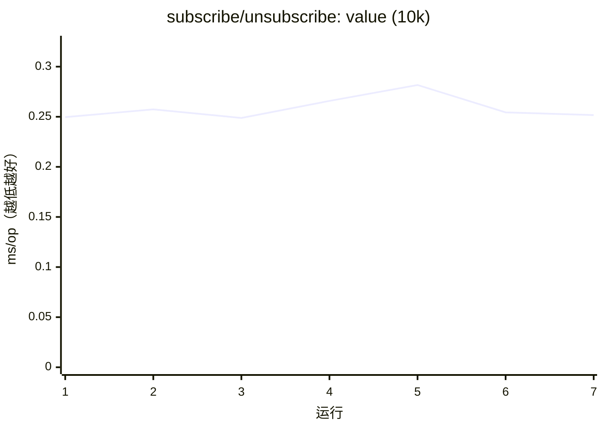
