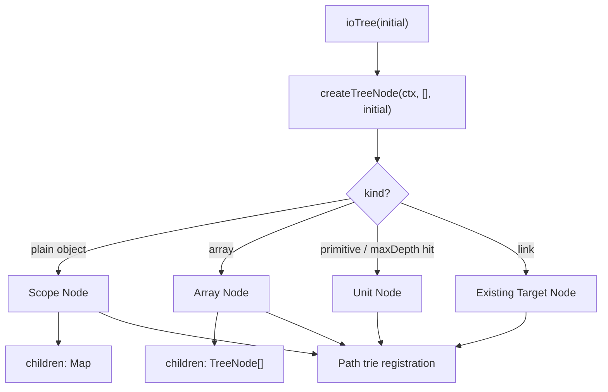
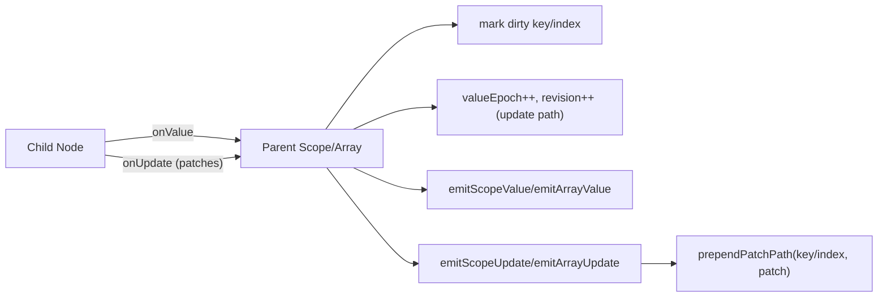
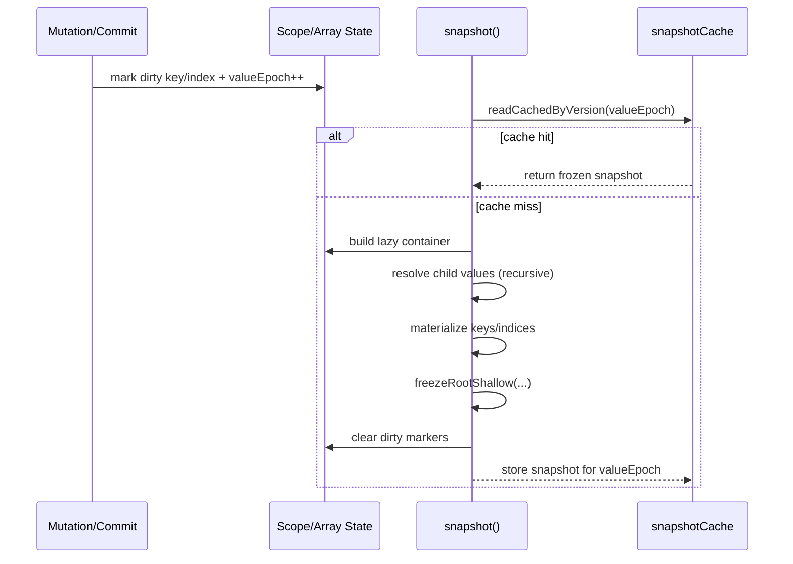
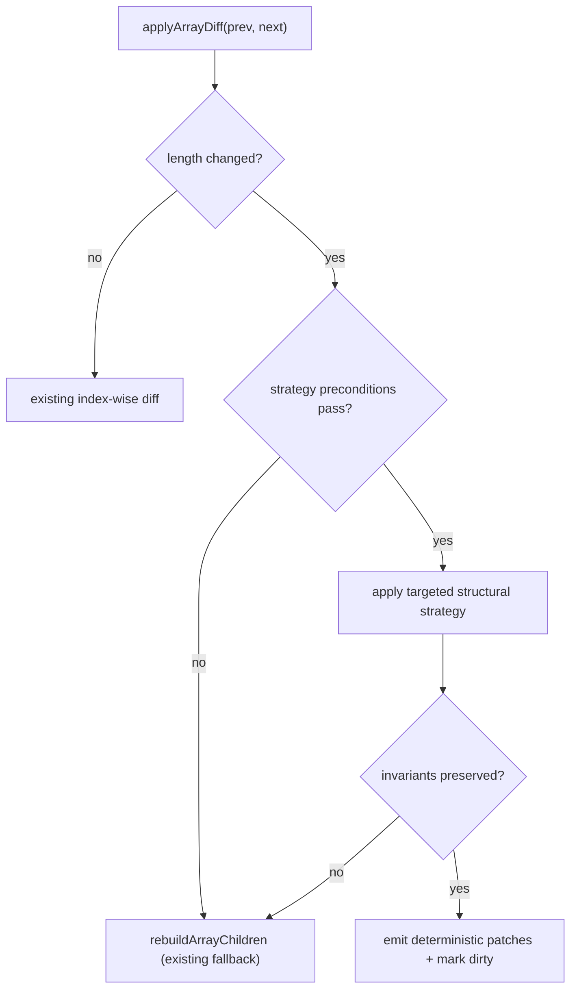

# Core Architecture

This document explains how the core tree engine is organized for human contributors.

## 1) Tree Model (Scope / Array / Unit)

The runtime normalizes user data into a node tree:

- `scope` node: plain object container (`Map<PropertyKey, TreeNode>`)
- `array` node: array container (`TreeNode[]`)
- `unit` node: leaf value container
- `link`: path alias that reuses an existing node

Implementation anchors:

- `/Users/zhangxueai/Projects/idea/oin/packages/io/src/lib/core/node-factory.ts`
- `/Users/zhangxueai/Projects/idea/oin/packages/io/src/lib/core/path-trie.ts`
- `/Users/zhangxueai/Projects/idea/oin/packages/io/src/lib/core/io-tree.ts`
- `/Users/zhangxueai/Projects/idea/oin/packages/io/src/lib/core/tree-context.ts`

## 2) Subscription Bubbling (Value + Update)

Each container subscribes to its direct children and re-emits events upward:

- value bubbling: recompute parent snapshot and notify value listeners
- update bubbling: prepend current segment to child patches and emit parent update

Implementation anchors:

- `/Users/zhangxueai/Projects/idea/oin/packages/io/src/lib/core/subscriptions.ts`
- `/Users/zhangxueai/Projects/idea/oin/packages/io/src/lib/container/bubbling.ts`
- `/Users/zhangxueai/Projects/idea/oin/packages/io/src/lib/core/commit.ts`

## 3) Snapshot Lifecycle

Snapshots are immutable and version-cached (`valueEpoch`):

1. Child change marks parent dirty key/index.
2. Snapshot read hits cache if `valueEpoch` is unchanged.
3. On miss, snapshot rebuild uses lazy property/index getters.
4. Lazy values are materialized once, then root is shallow-frozen.
5. Dirty markers are cleared after rebuild.

Implementation anchors:

- `/Users/zhangxueai/Projects/idea/oin/packages/io/src/lib/core/snapshot-scope.ts`
- `/Users/zhangxueai/Projects/idea/oin/packages/io/src/lib/core/snapshot-array.ts`
- `/Users/zhangxueai/Projects/idea/oin/packages/io/src/lib/core/dirty-indices.ts`

## 4) Commit Diff Lifecycle

`commit.ts` mutates the live tree in-place while producing replayable patches:

- recurse for scope/array nodes with matching shape
- unit nodes update in-place (`set` patch)
- incompatible nodes are replaced at the same path
- array length change becomes structural rebuild (`splice` patch)

This keeps subscription graph and path mapping consistent while preserving deterministic patch logs.

## 5) Change Boundaries (for Contributors)

This section defines what can change safely vs what is considered a core invariant.

### Safe-to-change areas

- Comment/docs-only updates.
- Internal heuristics that do not change public semantics (for example dirty-threshold tuning in array snapshot rebuild).
- Internal refactors that keep these externally visible behaviors unchanged:
  - snapshot immutability
  - patch shape and path semantics
  - subscription bubbling order and scope

### High-risk areas (require design review)

- `ioTree` node-kind classification rules in `/Users/zhangxueai/Projects/idea/oin/packages/io/src/lib/core/node-factory.ts`
- patch generation behavior in `/Users/zhangxueai/Projects/idea/oin/packages/io/src/lib/core/commit.ts`
- bubbling semantics in `/Users/zhangxueai/Projects/idea/oin/packages/io/src/lib/core/subscriptions.ts`
- snapshot cache invalidation and freeze behavior in `/Users/zhangxueai/Projects/idea/oin/packages/io/src/lib/core/snapshot-scope.ts`
- snapshot cache invalidation and freeze behavior in `/Users/zhangxueai/Projects/idea/oin/packages/io/src/lib/core/snapshot-array.ts`

### Must-hold invariants

- All snapshots exposed to users are immutable (root shallow-frozen, child snapshots immutable by construction).
- `valueEpoch` invalidates cached snapshots deterministically.
- Every live node remains discoverable through path-trie mapping at its current path.
- Bubbling updates prepend parent path segments correctly (`key`/`index`).
- Structural array changes produce `splice` patches; leaf replacements/updates produce `set` patches.

## 6) Extension Points

### A) Add a new node behavior (without adding a new node kind)

Use existing hooks before introducing new node taxonomy:

- node creation policy: `/Users/zhangxueai/Projects/idea/oin/packages/io/src/lib/core/node-factory.ts`
- subscription semantics: `/Users/zhangxueai/Projects/idea/oin/packages/io/src/lib/core/subscriptions.ts`
- commit strategy: `/Users/zhangxueai/Projects/idea/oin/packages/io/src/lib/core/commit.ts`
- snapshot materialization: `/Users/zhangxueai/Projects/idea/oin/packages/io/src/lib/core/snapshot-scope.ts`
- snapshot materialization: `/Users/zhangxueai/Projects/idea/oin/packages/io/src/lib/core/snapshot-array.ts`

Recommended sequence:

1. Define semantic goal and expected patch/output contract.
2. Update commit path first (what counts as change).
3. Wire dirty marking + bubbling behavior.
4. Update snapshot behavior and cache invalidation rules.
5. Add/adjust tests for snapshot, patch, and subscription behavior.

### B) Introduce a new node kind (advanced)

Only do this when existing scope/array/unit cannot model the semantics.

Touchpoints you must update:

1. tree internal types and kind guards:
   - `/Users/zhangxueai/Projects/idea/oin/packages/io/src/lib/core/io-tree-types.ts`
   - `/Users/zhangxueai/Projects/idea/oin/packages/io/src/lib/core/snapshot-scope.ts`
2. node factory classification and creation:
   - `/Users/zhangxueai/Projects/idea/oin/packages/io/src/lib/core/node-factory.ts`
3. commit diff handling:
   - `/Users/zhangxueai/Projects/idea/oin/packages/io/src/lib/core/commit.ts`
4. subscription attach/detach + bubbling:
   - `/Users/zhangxueai/Projects/idea/oin/packages/io/src/lib/core/subscriptions.ts`
5. snapshot read path + cache behavior:
   - `/Users/zhangxueai/Projects/idea/oin/packages/io/src/lib/core/snapshot-scope.ts`
   - `/Users/zhangxueai/Projects/idea/oin/packages/io/src/lib/core/snapshot-array.ts`

If any of the five touchpoints is skipped, behavior will become inconsistent.

## 7) Pre-merge Checklist

- Public semantics unchanged unless change is explicitly intentional and documented.
- Path-trie registration/unregistration remains balanced for replaced/rebuilt branches.
- No mutable object escapes from `snapshot()`.
- Patch logs remain replayable and serializable (especially when link values are involved).
- Nx lint/test for affected projects passes in a non-restricted environment.

## 8) Typical Change Template: Add an Array Structural Strategy

This is a practical template for introducing a new array structural mutation strategy.

Example goal:

- Current behavior: when `prev.length !== next.length`, array diff falls back to full rebuild + single `splice` patch.
- New strategy: for specific scenarios, emit a bounded sequence of targeted structural operations before fallback.

### Step 1: Define the contract first

Before code changes, write down:

- Trigger condition:
  - which input shapes enable the new strategy
  - when to fallback to existing full rebuild
- Patch contract:
  - whether emitted patches stay `splice`/`set` only, or add a new op
  - order guarantees for patch replay
- Snapshot contract:
  - final snapshot must be identical to old behavior for same input

If any contract item is unclear, stop and finalize it before implementation.

### Step 2: Keep change surface narrow

Start in:

- `/Users/zhangxueai/Projects/idea/oin/packages/io/src/lib/core/commit.ts`

Recommended pattern:

1. Add a small strategy selector inside `applyArrayDiff`.
2. Route only qualifying cases into your new strategy function.
3. Keep existing `rebuildArrayChildren` unchanged as fallback.

This minimizes regression risk because old behavior remains reachable.

### Step 3: Preserve core invariants while mutating

In your new strategy function, ensure:

- detach/attach subscriptions stay balanced for removed/inserted/reordered child nodes
- path-trie mapping is updated for every moved/replaced child
- `dirtyStructure` / `dirtyIndices` reflect actual change scope
- patch payload values remain immutable/replay-safe

If these cannot be guaranteed cheaply, fallback to full rebuild.

### Step 4: Test matrix (minimum)

Add/extend tests to cover:

1. Pure insert (`[] -> [a]`, middle insert, tail insert)
2. Pure delete (`[a,b] -> [a]`, middle delete)
3. Mixed reorder + value update
4. Duplicate node references in array
5. Link values inside arrays
6. Nested arrays/scopes with bubbling update paths
7. Fallback path still works and is selected when strategy preconditions fail

For every case, verify both:

- final `snapshot()` value
- emitted `patches` and bubbling update paths

### Step 5: Performance guardrail

Add a simple threshold and keep it explicit in code comments:

- if operation count estimate exceeds threshold, fallback to full rebuild

Reason: commit performance matters more than forcing a sophisticated diff in worst-case data shapes.

### Step 6: Rollout and rollback

- Gate the strategy behind a local condition or feature flag in early iteration.
- Keep one commit that only introduces scaffolding and one commit with behavior change.
- If regressions appear, disable strategy path and retain fallback rebuild path.

### Reference pseudo-flow

